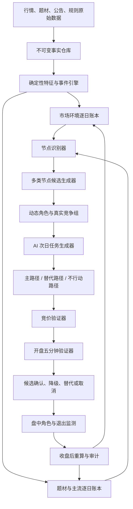

# roubing 逻辑驱动的 AI 选股工程：完整最优方案 V1

整理日期：2026-09-10

目标：把 roubing 分散在 2021—2026 年帖子中的市场判断、主流识别、节点交易、核心竞争、预期验证和退出逻辑，转成一套可实施、可回放、可审计、可被其他 AI 逐条评审的选股工程。

本文是独立工程方案，不修改 V2、V3、V4。它以《roubing 交易逻辑 V4》为方法底稿，同时重新核对了关键旧帖、2025 年末商业航天系列、2026 年超级主流、强弱切换、分歧修复、主动分歧和字母载体相关文章。

资料范围：2026 年 36 篇完整主帖正文、2021—2025 年 246 篇正文、全部 282 篇索引，以及已经拆分复核的 91 个操作判断单元。

原始资料：

- [2026 年正文](/Users/lee.dong/Documents/ChatGPT/test-stock-1/roubing_research_2026/work/roubing_2026_source_capture/roubing_2026_articles_raw.json)
- [2021—2025 年正文](/Users/lee.dong/Documents/ChatGPT/test-stock-1/roubing_research_2026/work/roubing_pre2026_articles_raw.json)
- [全部帖子索引](/Users/lee.dong/Documents/ChatGPT/test-stock-1/roubing_research_2026/work/roubing_all_topic_index_2023_2026.json)
- [V4 全文逻辑架构](/Users/lee.dong/Documents/ChatGPT/test-stock-1/roubing_research_2026/roubing_2026_fulltext_logic_analysis_v4_architecture.md)
- [全语料操作化审计](/Users/lee.dong/Documents/ChatGPT/test-stock-1/roubing_research_2026/roubing_full_corpus_operational_audit_v3.md)

---

## 一、最终结论：应该建什么，不应该建什么

最合适的产品不是一个“预测明天涨幅最高股票”的通用模型，也不是一个把全市场股票统一打分后取前十名的量化漏斗。

应该建设的是：

> **roubing 逐日市场推演、节点候选生成、核心角色竞争与次日验证系统。**

系统每天按固定顺序回答：

1. 截止当前时刻，哪些事实允许使用；
2. 市场现在是主升、轮动、退潮，还是新旧秩序切换；
3. 哪些题材正在由热点升级为持续资金路径；
4. 当前发生了什么节点；
5. 节点会自然产生哪一类候选股票；
6. 每只股票在方向里承担什么功能；
7. 哪几只股票才是真正互相竞争的；
8. 根据前一日状态，每只候选次日必须完成什么任务；
9. 竞价是否保留了原有强度；
10. 开盘五分钟是否经受住真实卖压；
11. 主路径是否确认，是否切换替代路径，还是取消全部候选；
12. 收盘后角色、主流和次日任务是否需要重建。

系统的核心输出不是一个脱离语境的股票代码，而是：

> **方向 + 节点 + 角色 + 竞争组 + 次日任务 + 确认条件 + 取消条件 + 证据链。**

### 为什么不能做全市场统一打分

roubing 的候选不是从同一个原因产生的：

- 情绪转折龙来自持续退潮后的高度破局；
- 低位伴飞来自转折龙形成当天的首板池；
- 补涨来自总龙断板当天的低位首板池；
- 低位伴生来自二波龙第一次分歧或停顿附近的首板池；
- 容量核心来自主流、大分歧、承接和带动；
- 旧核心与新核心切换来自同一方向内部的主动性迁移；
- 底背离节点候选来自指数停止杀跌时的逆势主动者；
- 突破后的第一次主动分歧，只对已经有核心地位且完成突破的股票有意义。

这些股票的起算日、任务、风险、比较对象完全不同。把它们先混在一个股票池里，以涨幅、成交额、封单、热度加权得分，会丢掉 roubing 方法最关键的“关系”和“时间位置”。

### 本系统明确不做

1. 不预测单票必涨；
2. 不输出仓位；
3. 不自动下单；
4. 不用固定分数替代市场关系；
5. 不把 A、B、C、D 臆造成完整评级体系；
6. 不把所有炸板强行分成主动或被动；
7. 不用当前板块成分和当前监管规则回填历史；
8. 不在看到 T+1 结果后改写 T 日理由；
9. 不把作者个案中的三天、四天、成交额、封单额、高开百分比变成永久阈值；
10. 不把“主力吸筹、洗盘、控盘、出货”当作无需证据的客观事实。

---

## 二、证据等级：其他 AI 评审时必须先看这一节

本文每项设计应归入以下五类之一。

| 类型 | 含义 | 工程处理 |
| --- | --- | --- |
| 作者明确 | 原帖直接给出出现时间、观察顺序、确认或取消 | 可以编码为条件化规则，但必须保留语境 |
| 稳定归纳 | 多篇文章反复出现，能归纳出稳定观察程序 | 可以执行，输出时说明是跨帖归纳 |
| 工程纪律 | 为防后验、幻觉、脏数据而增加，不是作者原话 | 必须执行，但不得冒充 roubing 原规则 |
| 个案或冲突 | 只有单篇数字、单票案例，或作者前后口径不一致 | 只能作为案例参考，不得固化为通用参数 |
| 数据阻断 | 过往交易日所需的竞价、盘口或逐笔委托事实不存在 | 相关判断输出 BLOCK，其他模块继续 |

上表有三处需要解释：

- “作者明确”不代表已经被独立市场回放证明有效，只代表作者讲清楚了怎么观察。
- “稳定归纳”不允许改写成固定数学阈值。
- “工程纪律”是系统可靠性的必要部分，例如信息截止时间、不可回填、缺数据必须拒答。

文档中出现的案例数字只能作为案例证据。例如 10 日 100%、30 日 200%、成交 30 亿、三日确认、四轮分歧等，都必须回到当时规则和案例语境。

---

## 三、roubing 的真正决策主轴

完整主轴必须保持如下顺序：

```text
信息截止时间
→ 市场环境
→ 主流方向
→ 当前节点
→ 功能角色
→ 真实竞争组
→ 次日任务
→ 主路径 / 替代路径 / 不行动路径
→ 竞价验证
→ 开盘五分钟验证
→ 候选确认或取消
→ 持有与退出检查
→ 收盘后重新推演
```

这个顺序不能被优化成“先找强股，再解释为什么强”。原因是：

- 同一根 K 线在主升、压力位下方和退潮阶段含义不同；
- 同样的高开，对昨天一字板和昨天爆量烂板要求不同；
- 同样的炸板，可能是市场拖累、主动释放分歧、高位推进失败或完全失去承接；
- 同样的区间涨幅，只有在同一起算日和真实竞争组中才有比较意义；
- 同样的反包，普通旧人气股和主流容量核心的地位完全不同。

### 一句话概括她的选股逻辑

> 先找到市场正在形成或维持的有序资金路径，再在关键节点产生候选，依据角色任务和同组竞争筛出核心，最后用次日竞价和开盘承接验证，而不是静态地寻找“指标最好”的股票。

---

## 四、工程总架构



### 八个工程层

1. **数据采集层**：保存行情、涨停原因、板块、竞价、分钟、成交、公告和规则。
2. **不可变事实层**：原始数据只能追加或版本化修订，不能被 AI 推理覆盖。
3. **确定性计算层**：计算涨跌幅、区间涨幅、板位、事件时间、平台、历史压力、成交分位和监管距离。
4. **逐日状态层**：保存环境、主流、节点和角色如何从昨天迁移到今天。
5. **节点候选层**：不同节点使用不同候选生成器，不做统一粗筛。
6. **AI 推理层**：解释市场关系、建立竞争组、生成逐票次日任务和路径。
7. **实时验证层**：竞价和开盘五分钟只验证盘后计划，不临时创造新故事。
8. **审计评估层**：检查证据来源、拒答、后验污染、规则忠实度和实际表现。

### 为什么采用“确定性程序 + AI”混合架构

程序适合：

- 严格处理时间、价格、成交、板位和规则版本；
- 扫描所有股票并找出事件；
- 防止漏票、算错、看错日期和数据倒灌；
- 保证同样输入得到同样的基础事实。

AI 适合：

- 判断一个方向是不是持续资金路径；
- 解释某个节点为什么成立或不成立；
- 识别股票在当下关系里的功能角色；
- 建立真正可比的竞争组；
- 根据前态生成“明天应该怎样”的自然语言任务；
- 处理主路径、替代路径和反证；
- 在作者规则不完整时明确保留不确定，而不是伪造公式。

让 AI 直接读取全市场原始行情会带来遗漏、计算错误和叙事漂移；让程序完全替代 AI 又会把动态关系僵化成固定阈值。混合架构最符合原方法。

---

## 五、系统每天应输出什么

### 1. T 日收盘后的市场计划

必须包含：

- 信息截止时间；
- 市场环境候选及反证；
- 主流方向、竞争方向及各自所处阶段；
- 当天新增节点；
- 每个方向的角色图；
- 每个节点自然产生的候选池；
- 每只候选所属竞争组；
- 每只候选次日必须完成的任务；
- 主路径、替代路径和不行动路径；
- 所有取消条件；
- 数据缺口和方法缺口；
- 每项结论对应的事实记录和原帖规则。

### 2. T+1 竞价报告

只允许输出：

- 原计划继续有效；
- 原计划降级，等待开盘验证；
- 主路径失效，替代路径接管；
- 所有路径取消。

不得在 9:25 看到新股票强势后，补写一个盘后不存在的新理由。真正突发的公告或政策可以建立“新信息路径”，但必须明确标注信息出现时间，不能伪装成昨晚已有计划。

### 3. T+1 开盘五分钟报告

对每只候选输出：

- 竞价强度是否延续；
- 第一轮卖压后是否承接；
- 是否强于同组竞争者；
- 是否得到板块、指数或容量支持；
- 主动性事件顺序；
- 当前状态：确认、继续观察、降级、被替代、取消。

### 4. T+1 收盘审计

输出：

- 哪些预期被确认；
- 哪些预期被推翻；
- 角色是否迁移；
- 主流秩序增强、维持还是瓦解；
- 当日买方次日是否可能有利润安全垫；
- 下一交易日需要重建哪些竞争组；
- 是否出现新的伴飞、补涨、伴生、二波或容量候选。

---

## 六、时间隔离与不可变事实

这是整个工程能否可信的第一道门。

### 1. 四个时间字段

每条事实至少保存：

| 字段 | 含义 |
| --- | --- |
| event_time | 行情、公告或规则真实发生时间 |
| available_at | 当时系统最早能够知道该事实的时间 |
| fetched_at | 系统实际抓取时间 |
| as_of | 本次推理允许使用事实的截止时间 |

如果公告在收盘后发布，即使公告日期写的是当天，也不能进入当天 14:30 的判断。

### 2. 四类推理快照

- EOD：T 日收盘后；
- AUCTION_0915 / AUCTION_0920 / AUCTION_0925；
- OPEN_5M：T+1 开盘五分钟；
- CLOSE_REVIEW：T+1 收盘后。

每次推理都生成新的版本，禁止覆盖旧版本。

### 3. 五栏证据分离

每项结论必须分栏保存：

1. 已观察事实；
2. 作者规则或解释；
3. AI 推断；
4. 无法确认的部分；
5. 截止时间之后的结果。

### 4. 后验污染检查

系统在保存每次报告时自动检查：

- 是否引用了 as_of 之后的分钟或收盘数据；
- 是否使用了未来才出现的板块成分；
- 是否使用了未来版本的监管规则；
- 是否根据最终龙头反向修改启动日候选池；
- 是否只保存赢家而删除当时真实竞争者；
- 是否把作者事后复盘叙述当成盘前已经知道的事实。

任一命中，报告标记为 INVALID_FOR_BACKTEST。

---

## 七、数据方案

### 1. 主要数据源

| 数据任务 | 首选来源 | 边界 |
| --- | --- | --- |
| 多年个股日线和复权 | Financial-API 市场全量文件 | 保存原价和复权口径 |
| 指数、行业、概念日线 | Financial-API | 历史分钟需其他来源 |
| 历史涨停、跌停、炸板和涨停原因 | Financial-API，eltdx 校验 | 两者冲突分别保存 |
| 当日竞价全过程 | eltdx | Financial-API 只适合当前快照与终态 |
| 历史 09:25 撮合及可得竞价过程 | eltdx | 留存范围逐日验收 |
| 分钟和成交明细 | eltdx | 成交不等于完整委托流 |
| 实时五档 | eltdx | 必须连续采样才能形成过程 |
| 个股 F10 题材 | eltdx | 与当日涨停原因分开 |
| 公告发现 | eltdx 公告列表 | 关键内容回到交易所或巨潮原文 |
| 监管规则 | 上交所、深交所、北交所、证监会正式文件 | 按生效日期版本化 |

### 2. 涨停原因是短线题材归组的第一入口

处理顺序：

1. 汇总当日全部涨停原因；
2. 对同义原因进行语义归并，但保留原始文本；
3. 标记新原因、连续原因和旧原因；
4. 统计同一原因下的先锋、连板、容量和后排扩散；
5. 检查次日是否继续给溢价；
6. 检查分歧后是否仍有核心修复；
7. 只有“原因持续 + 资金持续选择 + 分歧后修复”才允许升级为主流。

F10 题材回答“公司和什么有关”，涨停原因回答“市场今天为什么交易它”，两者不能混成一个字段。

### 3. 建议事实表

| 表 | 主键 | 核心内容 |
| --- | --- | --- |
| stock_daily_bar | 股票 + 日期 + 复权口径 | 开高低收、量额 |
| index_daily_bar | 指数 + 日期 | 市场和板块行情 |
| board_membership_snapshot | 板块 + 股票 + 保存日期 | 当时成分 |
| limit_event | 日期 + 股票 + 来源 | 涨停、跌停、炸板、时间、板位、封单、原因 |
| theme_fact_daily | 日期 + 股票 + 原因或题材 | 当日叙事与公司关联事实 |
| auction_point | 日期 + 股票 + 时刻 + 来源 | 竞价价格、匹配量、未匹配量及方向 |
| opening_match | 日期 + 股票 | 09:25 正式撮合 |
| minute_bar | 日期 + 股票 + 分钟 | 分钟价格、量、均价 |
| trade_tick | 日期 + 股票 + 序号 | 成交时间、价格、量、方向、事件类型 |
| depth_snapshot | 日期 + 股票 + 时刻 | 实时五档 |
| announcement | 股票 + 公告标识 | 时间、标题、类别、原文 |
| rule_version | 市场 + 板块 + 规则 + 生效日 | 当时有效监管规则 |

### 4. 推理结果表

推理结果绝不能写入事实表。至少建立：

- market_state_daily；
- theme_ledger_daily；
- node_event；
- role_assignment；
- competition_group；
- tomorrow_task；
- path_plan；
- validation_event；
- candidate_state_history；
- reasoning_trace；
- evaluation_result。

### 5. 真正的数据 BLOCK

| 项目 | 状态 | 影响 |
| --- | --- | --- |
| 完整历史 9:15—9:25 竞价回放 | BLOCK | 取不到的日期不能判断中途撤单、封单排名迁移 |
| 完整历史五档队列回放 | BLOCK | 不能还原旧日每一刻挂单和队列 |
| 完整历史逐笔委托与撤单 Level-2 | BLOCK | 不能确认具体撤单者和全部订单意图 |

缺少上述数据时，只阻断依赖过程的判断，不阻断日线层环境、主流、节点和角色推演。

---

## 八、确定性特征与事件引擎

这一层只计算事实，不作“龙头”“主流”“洗盘”等主观结论。

### 1. 日线和区间事实

- 当日及历史开高低收、量额；
- 前复权、后复权与不复权；
- 上市天数、风险警示、涨跌停价格；
- 从指定起算日开始的区间涨幅；
- 区间最高、最低、最大回撤；
- 平台、前高、历史阴 K 高点等候选压力；
- 是否越过压力、收盘是否站稳、次日是否重新跌回；
- 阳线、阴线、低点抬高等描述性结构；
- 成交额在全市场、板块和自身历史中的分位。

成交分位只用于描述容量，不用于固定认定容量核心。

### 2. 涨停与梯队事件

- 首次触板、最终封板、炸板、回封时刻；
- 开板次数；
- 连板高度；
- 实体换手板、一字板、T 字板等可观察形态；
- 同一方向当日首板池；
- 总龙断板日首板池；
- 二波核心第一次分歧日首板池；
- 同一起算日仍存活的候选。

### 3. 竞价事件

- 9:15、9:20、9:25 价格和封单；
- 封单额排名变化；
- 匹配量和未匹配量变化；
- 一字维持、撤单、由弱转强、由强转弱；
- 09:25 正式高开幅度和成交；
- 同组候选排名迁移。

9:15、9:20、9:25 是记录框架，其中 9:20 明确排序案例主要来自 2026-08-01，不能宣称是作者多年固定三段公式。

### 4. 分时事件

- 低开后快速拉红；
- 下探后低点连续抬高；
- 回踩前日低点、平台或均价不破；
- 放量越过前高、平台或分时均线；
- 谁先拉升、谁先触板、谁先炸板、谁后被带动；
- 板块指数、容量股和候选的同步时间；
- 触板后是否有真实换手和回封。

### 5. 监管事实

- T 日有效规则版本；
- 计算窗口、偏离值和适用指数；
- 当前异动公告；
- 预计下一交易日不同收盘情形下是否触发；
- 停复牌、重点监控或风险提示状态；
- 规则版本是否完整。

监管空间只是路径条件，不是孤立买入理由。

---

## 九、市场环境状态机

环境是所有选股模块的上游条件，禁止先选股票再倒推环境。

### 1. 主流主升环境

观察：

- 指数没有系统性快速下行；
- 至少一个方向连续得到资金；
- 板块指数走强或突破；
- 先锋、容量和扩散层共同存在；
- 分歧后核心能够率先修复；
- 前一日参与者持续获得溢价；
- 原核心受限时有新载体承接。

工程输出：MAIN_TREND_CANDIDATE 或 MAIN_TREND_CONFIRMED，并列出支持和反证。

### 2. 轮动震荡或一九分化

观察：

- 指数区间震荡；
- 板块今天强、次日弱，持续性有限；
- 没有稳定高度，但可能存在少数容量或分支核心；
- 大多数跟风无溢价；
- 赚钱集中于一成左右有辨识度股票。

处理：只允许节点明确的核心和短周期路径，不把热点首日直接升级主流。

### 3. 下跌或系统性风险

观察：

- 指数沿短期趋势快速下行；
- 强势股和指数同步放量下跌；
- 高标连续跌停；
- 昨日强板普遍无溢价；
- 新方向也无法完成次日确认。

处理：选股系统可以继续识别候选，但默认输出不行动；只有底背离、恐慌修复或明确分离节点才建立条件路径。

### 4. 新旧秩序切换

观察：

- 旧核心失去带动；
- 旧方向修复高度和响应逐次衰减；
- 新方向在旧方向走弱时主动增强；
- 新方向出现先锋、容量或完整梯队；
- 新旧方向不是一起上涨，而是资金功能发生迁移。

处理：同时保存旧路径退出任务和新路径确认任务，不能因为新票单日最强就直接宣布切换完成。

### 5. 状态迁移原则

环境状态不是一次分类，而是逐日账本。每天保存：

- 昨日状态；
- 今日新增证据；
- 今日反证；
- 是否迁移；
- 明日验证任务。

不使用“满足三项就是主升”之类计数公式。AI 必须解释哪些关系发生了变化。

---

## 十、主流方向逐日账本

### 1. 主流不是接口字段

历史主流必须从最早日期逐日推演。对每个候选方向保存完整生命周期：

```text
新原因或新题材
→ 热点候选
→ 次日延续
→ 弱主流或主流候选
→ 多角色协同
→ 主流确认
→ 首次分歧
→ 修复成功 / 修复失败
→ 主升 / 震荡
→ 二波候选 / 内部切换
→ 退潮或结束
```

### 2. 每个方向每天必须回答

1. 催化今天是否仍在出现；
2. 涨停原因是否继续扩散；
3. 是否有先锋、高度、容量和低位层；
4. 板块指数是否连续走强或突破；
5. 昨日参与者今天是否有利润；
6. 分歧后谁先修复；
7. 原核心受限后是否有人接替；
8. 与竞争方向相比，资金是在流入还是流出；
9. 当前阶段是启动、延续、分歧、修复、主升、震荡、二波还是退潮；
10. 明天什么现象会确认或推翻当前阶段。

### 3. 普通主流与超级主流

超级主流不能由“涨了四天”或“第四次弱转强”机械确认。

稳定部分是：

- 已存在完整多角色结构；
- 经历多轮分歧后仍能在同一方向内部修复；
- 容量核心持续承接；
- 旧核心受限或乏力时，内部能切换到新分支或新载体；
- 每轮修复仍能让参与者获得正反馈；
- 板块资金不是只依赖一只孤立股票。

2025 年末商业航天的四次分歧弱转强是案例链：第一次萌芽、第二次强化、第三次巩固、第四次确认穿越。工程应保存“第几轮压力测试”，但不能规定所有超级主流必须恰好四轮。

### 4. 龙头代表的是秩序，不是单日最强

2026-09-05 的核心补充是：总龙的价值在于让分散资金形成可交易秩序。

因此方向账本还要保存：

- 总龙是否继续打开空间；
- 中军是否稳定板块重心；
- 中段助攻是否提供接力；
- 低位跟随是否扩散赚钱效应；
- 上述层级是否仍互相响应；
- 结构瓦解后，市场是否重新回到无序轮动。

工程可以将其命名为“秩序证据矩阵”，但不能计算一个武断的低熵总分。

---

## 十一、节点引擎

节点不是固定形态，而是原有运行规律发生转折、突破或迁移的时刻。

每个节点记录：

- node_type；
- anchor_date：起算或触发日期；
- trigger_facts：触发事实；
- prior_regime：节点前的旧规律；
- broken_rule：被打破的限制或旧状态；
- candidate_scope：自然候选池；
- confirmation_task；
- cancellation_task；
- evidence_level；
- source_posts。

### 节点类型

1. 情绪转折与高度破局；
2. 主流确认；
3. 主流第一次大分歧；
4. 大分歧后的修复；
5. 平台、前高或旧规律突破；
6. 唯一性确认；
7. 主流内部强弱切换；
8. 高低切换；
9. 二波；
10. 指数超卖、底背离或恐慌修复；
11. 原核心断板；
12. 二波第一次分歧或上升停顿；
13. 监管空间切换；
14. 高位推进失败与秩序瓦解。

节点识别器不直接选出最终股票，只负责打开相应候选生成器。

---

## 十二、十二类候选生成器

每个生成器都必须写清起算日、候选来源、确认、取消和输出。不同生成器的候选可以重叠，但不能混成一个统一分数榜。

### 生成器何时被激活

| 市场与方向状态 | 优先激活 | 默认限制 |
| --- | --- | --- |
| 持续退潮后的情绪破局 | G1、G2、G8 | 未真正突破旧压制前不确认 |
| 新方向由热点向主流升级 | G7、G8、G11 | 只有小票脉冲时不升级 |
| 主流第一次大分歧 | G6、G7、G12 | 分歧日不能无条件抄底 |
| 主流震荡、准备二波 | G3、G5、G8、G9 | 首波没有地位者排除 |
| 总龙断板或高位受限 | G4、G10 | 原方向整体退潮时全部取消 |
| 主流内部旧强乏力 | G9、G10 | 新候选必须主动，不接受被反推 |
| 指数极度恐慌或底背离 | G11 | 指数未止跌前默认不行动 |
| 一九分化或轮动震荡 | G7、G8、G9、G12 | 只保留核心和明确节点，跟风排除 |
| 系统性快速下跌 | G11 | 除确认的恐慌修复外，其他生成器只观察不升级 |

生成器激活是“允许建立候选池”，不是直接给出股票结论。

### G1：情绪转折龙

**作者依据**：2023-12-05。

**触发背景**：

- 市场持续退潮；
- 原有连板高度或情绪压制长期未被突破；
- 某只股票通过换手和盘中反转打破原压制。

**候选来源**：当日所有实际突破旧高度或旧情绪规律的股票。

**观察顺序**：

1. 旧高度和旧压制是什么；
2. 候选是否真正越过；
3. 是否经过换手，而非单纯连续一字；
4. 是否带动同类赚钱效应；
5. 次日是否仍有溢价。

**确认**：突破后站住、次日继续强，并使市场高度或同类情绪改善。

**取消**：只盘中触及后回落，或次日直接失去溢价。

**输出角色**：情绪转折龙候选、情绪高度核心候选。

### G2：低位伴飞

**作者依据**：2023-12-05。

**起算日**：情绪转折龙形成的当天。

**候选来源**：该日首板池，不是之后任意低位股票。

**原文案例确认方式**：

- 观察后续换手实体三板；
- 优先更早上板、竞争中持续转强者。

三板是该案例的确认路径，不应脱离情绪周期机械硬套。

**取消**：

- 未能从同日首板中晋级；
- 依赖总龙上涨但自身无持续性；
- 同组候选已经明显胜出。

**输出角色**：伴飞或助攻候选。

### G3：伴飞向二波龙升级

**作者依据**：2023-12-07。

**前置条件**：

- 第一波已经获得伴飞或重要助攻地位；
- 有新题材或新消息继续刺激；
- 首波未受到足以封死空间的重点监管；
- 技术上接近或突破历史实体阴 K、平台或压力。

**竞争**：只比较同一轮、同起点、同功能候选。

**确认**：

- 在关键日主动突破；
- 竞争者冲高回落时仍能继续推进；
- 重新获得板块或市场带动。

**取消**：只有旧人气反抽，没有新催化、空间或板块响应。

**输出角色**：二波龙候选。

### G4：总龙断板后的补涨

**作者依据**：2023-12-10。

**起算日**：总龙第一次断板的当天。

**候选来源**：该日首板池。

**盘后初筛**：

- 实体板优先；
- 分时直线拉板或主动性更强；
- 所属板块逻辑仍有效。

**次日验证**：

- 9:15—9:25 是否出现一字或强开；
- 同组谁保留封单、谁先转弱；
- 后续板上分歧中谁持续胜出。

**取消**：

- 原板块已经整体退潮；
- 候选只是孤立消息票；
- 次日竞价落后且开盘无法夺回。

**输出角色**：补涨候选，不在断板日直接写成补涨龙。

### G5：二波第一次分歧后的低位伴生

**作者依据**：2023-12-16。

**起算日**：二波龙形成后的第一次放量分歧日。

**候选来源**：该日首板池。

**后续任务**：

- 二波核心持续上涨后出现停顿；
- 候选在停顿次日重新涨停或主动增强；
- 与板块属性共振；
- 在趋势、上板时间和同组竞争中胜出。

**取消**：高位核心已经彻底结束、板块没有修复，低位票只是孤立轮动。

**输出角色**：低位伴生候选。

### G6：主流第一次大分歧后的修复核心

**作者依据**：2024-11-16、2025-05-11、2025-05-30、2026-05-30、2026-06-06。

**触发背景**：

- 方向此前已经是主流或强分支；
- T 日发生板块级大分歧；
- 分歧日仍有前排或核心保持热度；
- 不能把普通下跌方向的反抽叫主流修复。

**候选来源**：

- 原总核心、分支核心、容量核心；
- 分歧日抗跌者；
- 次日率先与指数、板块共同修复者。

**确认**：

- T+1 板块止跌或反包；
- 候选高开或下探后承接；
- 候选主动走强，强于同组；
- 容量、板块或其他层级响应。

**取消**：

- 后排继续大阴或跌停；
- 核心无法反包；
- 只有一只小票上涨；
- 分歧后没有资金回到原方向。

**输出角色**：修复核心、分支主升候选。

### G7：容量核心

**作者依据**：2024-12-07、2024-12-12、2025-01-16、2025-05-11、2026-01-03。

**前置条件**：

- 新热点、主流或旧龙结束后的承接环境；
- 股票具备大成交和可进出性；
- 不能仅因成交额大就认定。

**候选来源**：方向内成交容量显著、市场关注高、能够影响板块的股票。

**确认链**：

1. 经历一次或两次大分歧后仍能快速走强；
2. 竞价高开只表示态度，不单独确认；
3. 分时强度与指数或板块修复共振；
4. 上板或突破后带动其他股票；
5. 后续大成交仍能推进，而非只放量滞涨。

**取消**：

- 只有大成交、没有价格推进；
- 板块修复时明显落后；
- 上涨由其他核心反推；
- 大分歧后承接失败。

成交 10 亿、30 亿、日均 100 亿等均是不同阶段案例，不设统一下限。

### G8：同一起算日的唯一性

**作者依据**：2024-05-10、2025-03-15、2025-12-06。

**起算日**：节点日、情绪止跌日、板块启动日或作者明确的共同首板日。

**候选来源**：同日起步且功能相近的股票。

**比较维度**：

- 区间涨幅；
- 换手高度；
- 趋势韧性；
- 是否再次涨停或转强；
- 容量和市场关注；
- 涨停时间与竞价主动性；
- 是否带动板块；
- 是否面临监管或压力约束。

**确认**：运行若干日后，在同组竞争中形成阶段唯一性，并在次日完成自身任务。

**取消**：新对手主动胜出、原候选不及预期或失去带动。

三到四天是常见案例观察窗口，不是所有唯一性的强制天数。

### G9：旧核心与新核心的强弱切换

**作者依据**：2023-10-11、2025-08-19、2025-12-20、2026-01-03、2026-03-14。

**前置条件**：主线或板块整体仍然有效。

**候选来源**：

- 旧核心；
- 同板块、同容量或同功能的新候选；
- 在旧核心滞涨时逆势主动的分离股。

**事件顺序**：

1. 旧核心先出现该强不强、滞涨、破位或竞价弱；
2. 新候选主动高开、突破、上板或逆板块推进；
3. 板块对新候选产生响应；
4. 旧核心若在新候选上板后才反抽，属于被动。

**确认**：新候选持续完成任务，旧核心失去唯一性。

**取消**：新候选只是被旧核心带起，或主线指数已经破位、新旧一起弱。

### G10：高低切换与监管空间迁移

**作者依据**：2023-10-12、2024-05-09、2025-11-29、2025-12-13、2026-01-11。

**触发背景**：

- 高位核心接近监管或异动窗口；
- 连板空间受限；
- 高位载体明显走弱；
- 主流资金仍未离开整个方向。

**候选来源**：

- 对应切换日的低位新题材或首板；
- 主流内部空间更大的分支；
- 可承接大资金的容量股；
- 绕异动但仍有地位的强趋势股票。

**确认**：

- 低位或新载体主动走强；
- 原方向资金和板块响应；
- 不是任意低位脉冲。

**取消**：高低一起弱，或低位票没有板块和资金延续。

### G11：指数底背离或恐慌修复中的主动带动者

**作者依据**：2025-01-09、2025-01-16、2025-11-29。

**触发背景**：

- 指数超跌、底背离或极度恐慌；
- 跌速开始放缓；
- 仅有技术超卖不算节点完成。

**候选来源**：

- 下跌中仍保持上升结构的股票；
- 先停止跟跌、持续有主动大单的股票；
- 指数和题材止跌时率先上板或反包的股票；
- 此前强势方向中地位高、容量唯一的候选。

**确认**：

- 次日指数和题材共同向上；
- 候选分歧转一致或反包；
- 分时强度与指数反弹共振；
- 上板后能带动板块。

**取消**：

- 指数继续新低；
- 候选只是孤立反抽；
- 次日没有完成其地位应有的强度。

超买、底背离和多周期超卖的具体指标参数在原文中没有统一定义，应保留方法缺口。

### G12：突破后的第一次主动分歧

**作者依据**：2026-08-01。

**前置条件**：

- 股票已是核心或有明确辨识度；
- 已完成有效突破；
- 分歧发生在突破之后，不是在压力位下方。

**候选来源**：核心上升中第一次放量分歧的股票。

**确认**：

- 次日竞价弱转强；
- 开盘后快速拉升或上板；
- 板块和角色仍有效。

**次日任务示例**：

- 根据前一天力度，本应继续连板；
- 至少应触及涨停，才能证明仍有主动进攻资金。

“至少摸板”来自具体前态和案例，不是所有分歧票的统一要求。

**取消**：

- 次日早盘连摸板尝试都没有；
- 随后翻绿或失去关键支撑；
- 分歧发生在未突破压力前；
- 原角色已经被替代。

### 四类覆盖逻辑：不是新的全市场筛选器

以下概念在作者体系中重要，但它们不能脱离环境、节点、主流和角色单独产生股票池。

#### 1. 效应复制

作者会把已经产生赚钱效应的历史案例作为新机会的参照，例如：

- 相似的节点；
- 相似的板块阶段；
- 相似的角色；
- 相似的强弱切换；
- 相似的操作手法。

工程实现必须比较“环境 + 节点 + 角色 + 竞争关系 + 行为顺序”，不能只比较 K 线图像。

效应复制的输出只能是：

- 可类比；
- 局部可类比；
- 不可类比；
- 数据不足。

作者没有给出效应何时耗尽、失败几次后停止和同期失败样本的统一标准，因此不能自动把历史成功形态永久外推。

#### 2. 反人性与特殊预期差

反人性不是“别人害怕就买”。必须同时存在：

- 市场存在明确惯性预期；
- 实际表现与惯性预期相反；
- 原结构和角色没有被破坏；
- 资金通过竞价、承接、突破或带动确认。

2024-11-23 的特殊预期差还要求处于主升初期或强主升，并结合当下唯一性；不适用于普通超跌反弹。

#### 3. 冰剑双战法

工程化后的可靠部分：

- “冰”用于风险阶段、等待企稳和防止盲目抄底；
- “剑”用于拐点、突破和主动进攻确认；
- 缩量调整、关键支撑和次日反包可以构成候选证据。

不能直接编码的部分：

- 缩量大跌不必然等于洗盘；
- 放量大跌不必然等于主力出货；
- “筹码没松动、主力没跑”不是仅凭量价就能确认的事实。

所以冰剑只能作为节点内的风险—进攻观察框架，不能把“大跌缩量”直接变成买入条件。

#### 4. 催化、产业逻辑和“瓶底”

短线工程首先使用涨停原因、公告和板块资金确认市场正在交易的叙事。产业逻辑可以增加方向持续性的解释，但必须接受盘口和次日反馈验证。

作者对政策、产业、估值、供需和财务如何组合没有统一权重。系统可以输出证据链和待核实问题，不能生成一个“产业逻辑分”后覆盖市场事实。

---

## 十三、功能角色系统

角色不是股票永久属性，而是“出现时间 + 节点关系 + 市场功能 + 次日任务”的组合。

### 1. 角色定义

| 角色 | 当前功能 | 主要确认 |
| --- | --- | --- |
| 总核心或总龙 | 组织整个方向、打开空间、维持秩序 | 多次分歧后仍先修复，能带动板块和其他层级 |
| 情绪或高度核心 | 打破连板或情绪压制 | 换手站住、继续给溢价、改善同类情绪 |
| 容量核心或中军 | 承接大资金、稳定板块重心 | 大成交后仍推进，修复时同步并带动 |
| 分支核心 | 在主线某一细分方向承担领涨或容量任务 | 分支内领先，并与总方向形成响应 |
| 助攻或伴飞 | 扩散赚钱效应、帮助总核心维持高度 | 特定节点出现，后续晋级和溢价 |
| 补涨 | 总龙断板后承接低位资金 | 断板日首板起算，竞价和板上竞争胜出 |
| 低位伴生 | 二波分歧或停顿时延长周期 | 对应节点首板起算，停顿后再次确认 |
| 二波载体 | 首波有地位，调整后重新突破 | 结构未坏、突破主动、板块恢复响应 |
| 旧核心残余人气 | 技术地位下降但仍有反抽流动性 | 常由新核心反推，更偏退出窗口 |
| 跟风或杂毛 | 依赖核心上涨，没有独立功能 | 主流分歧时先失去溢价 |

### 2. 角色事件溯源

每次角色变化必须保存：

- previous_role；
- new_role；
- effective_at；
- trigger_event；
- supporting_facts；
- disconfirming_facts；
- source_rule；
- next_task；
- expiry_condition。

例如，一只股票不能仅因今天涨停就从“跟风”直接覆盖成“总核心”。系统必须说明它打破了什么限制、战胜了谁、带动了谁，以及明天还需要完成什么。

### 3. A、B、C、D 载体如何处理

现有全文可确认：

- A：百花医药被称为哈药二波主升中的连板助攻核心；万向德农被称为金健米业的强一字助攻；
- B：汉森制药被称为板块内部强势连板主升载体，对总龙形成助攻；
- D：在高位核心受监管或原载体结束后，承担后段续命功能；
- C：当前抓取正文未找到定义。

正确工程处理：

1. 功能角色照常判断；
2. 只有作者明确点名的历史案例保留原字母；
3. 新股票的 letter_carrier 默认 UNKNOWN；
4. 不把核心、容量、补涨、伴飞、伴生与 A/B/C/D 一一对应；
5. 不自动做字母升级或降级。

这是方法缺口，不是数据接口缺口。

---

## 十四、真实竞争组

roubing 的“唯一性”和“卡位”只能在真实可比对象之间成立。

### 1. 建组条件

竞争组可以按以下条件交叉建立：

- 同一题材或同一分支；
- 同一起算日或同一节点日；
- 同一连板身位；
- 同一功能角色；
- 相近成交容量；
- 同为旧核心与新核心候选；
- 同为断板日补涨候选；
- 同为二波分歧日伴生候选。

一只股票可以同时属于多个竞争组，例如既参加同起算日唯一性竞争，也参加容量核心竞争。

### 2. 不可比较的典型情况

- 一字情绪小票与百亿成交容量股直接比封板速度；
- 不同启动日股票直接比总涨幅；
- 主流补涨与新题材先锋混在一起；
- 总龙与围绕它运行的助攻票按同一任务比较；
- 创业板弹性股和主板连板股不考虑制度差异直接比高度。

### 3. 组内比较顺序

1. 前一日角色和状态；
2. 起算日以来的持续性和韧性；
3. 竞价封单、开盘和排名变化；
4. 谁先主动拉升或突破；
5. 谁先上板，谁被谁反推；
6. 第一轮卖压后的承接；
7. 是否带动板块、容量或助攻；
8. 次日是否继续完成自身任务。

### 4. 不使用总分，使用支配关系

组内判断采用：

- A 明确胜于 B；
- A 暂时领先，但需次日确认；
- A 与 B 不可判；
- A 的原任务失效，B 接管；
- 全组失效。

如果一只股票在主动性、带动和次日任务上都优于另一只，可形成支配关系。若各有优劣，AI 必须保留并列候选，不得靠隐藏权重硬选一个。

### 5. 卡位的完整定义

卡位不是某一刻价格超过，也不是一次更早触板。至少应包含：

- 盘前已在同一竞争组；
- 竞价或开盘主动强于对手；
- 关键事件先于对手；
- 板块或资金对其产生响应；
- 对手无法夺回原任务；
- 后续或次日仍能维持结果。

### 6. 最终如何从多个竞争组形成选股结果

系统不追求每天强行选出唯一一只股票，而是按以下顺序收敛：

1. **环境门**：当前环境是否允许该类节点进入可执行观察；
2. **主流门**：所属方向是否至少具备延续或修复条件；
3. **节点门**：候选是否来自正确起算日和候选池；
4. **角色门**：候选是否承担不可替代的功能，而非普通跟风；
5. **竞争门**：候选是否在真实同组中领先或至少没有被支配；
6. **次日任务门**：竞价和开盘是否完成了根据前态生成的任务；
7. **板块响应门**：候选走强后，方向内是否有容量、助攻或指数响应；
8. **风险门**：监管、公告、流动性和数据完整度是否允许继续验证。

最终只使用四种中文层级，避免和作者未定义完整的 A/B/C/D 混淆：

| 输出层级 | 含义 |
| --- | --- |
| 主候选 | 主路径有效、组内领先、次日任务已确认 |
| 待验证候选 | 盘后逻辑成立，但仍需竞价或开盘确认 |
| 替代候选 | 只有主路径指定条件失效后才能接管 |
| 取消或不行动 | 任何必要条件失效，或数据不足以验证 |

如果两个候选分别承担情绪核心和容量核心功能，系统可以同时保留，不能为了输出单一代码而把不同角色硬排成第一和第二。

---

## 十五、逐票次日任务生成器

这是 AI 推理的核心，不是固定阈值表。

### 1. 输入

- T 日市场环境；
- 所属方向和阶段；
- 当前节点；
- 当前角色；
- T 日具体状态；
- 同组对手；
- 板块和容量状态；
- 监管空间；
- 历史上同一股票最近相似前态；
- 数据完整度。

### 2. T 日状态必须具体描述

不能只写“强”或“弱”，至少记录：

- 一字、秒板、换手板、T 字、烂板、反包、炸板；
- 首次分歧、连续分歧、高位滞涨、平台突破；
- 主动上涨、被板块带动、逆指数、逆旧核心；
- 成交是放大、缩小还是历史异常；
- 是否带动板块；
- 是否在竞争中领先；
- 是否接近监管或技术压力。

### 3. 三组比较

**和自己昨天比较**

昨天的力度决定今天应完成什么，不使用全市场统一高开标准。

**和同组对手比较**

旧主动者次日应继续强于原第二名；若竞价落后且开盘无法夺回，原主动地位失效。

**和板块环境比较**

板块修复时核心应率先修复；板块弱时核心若能逆势不跌并主动推进，可能形成分离。

### 4. 原帖支持的任务映射

| 前一日状态 | 次日任务 |
| --- | --- |
| 情绪转折核心强势破局 | 应延续高度惯性，封单和开法必须匹配其地位 |
| 一字板 | 通常应继续明显强开；仅普通高开可能不及前态 |
| 强换手涨停、无明显抛压 | 应有较强高开和延续 |
| 板块爆发日换手核心 | 应有连板或至少明显主动进攻预期 |
| 大分歧后的容量核心 | 竞价需表态，开盘还要与指数、板块共振并带动 |
| 突破后第一次主动分歧 | 次日应弱转强；特定强主升前态可能至少需要摸板 |
| 分歧日主动第一名 | 次日应继续强于同组原第二名 |
| 平台突破核心 | 应站住压力或回踩后重新向上，不能立刻跌回平台 |
| 旧核心二波候选 | 应一鼓作气；尾盘炸板、被新核心反推则降级 |
| 板块大分歧中抗跌核心 | 修复日应率先走强，落后则不及角色预期 |
| 高位人气股不及预期 | 反抽更多是退出窗口，不能自动当重新转强 |

具体高开百分比、封单额和成交量由个股前态生成，无法推出时必须写“无可靠数字阈值”。

### 5. 标准任务格式

```json
{
  "thscode": "示例代码",
  "as_of": "T日收盘后",
  "theme": "所属方向",
  "node": "当前节点",
  "role": "当前功能角色",
  "competition_group": "真实竞争组标识",
  "observed_state": [
    "T日已经发生的事实"
  ],
  "tomorrow_must_do": [
    "次日必须完成的任务"
  ],
  "acceptable_variants": [
    "虽然不是最强开法，但仍可保留路径的表现"
  ],
  "failure_signals": [
    "一旦出现就降级或取消"
  ],
  "needs_open_confirmation": true,
  "unknowns": [
    "原文没有统一定义或数据不足的部分"
  ],
  "evidence": [
    "事实记录标识",
    "原帖日期和规则"
  ]
}
```

---

## 十六、三路径条件树

盘后不能只写一个看多剧本。

### 1. 主路径

描述最符合当前环境、主流、节点和角色的延续方式。

必须写：

- 哪个方向继续；
- 哪个角色优先；
- 哪只股票需完成什么；
- 竞价确认；
- 开盘确认；
- 取消条件。

### 2. 替代路径

只在主路径预设的替代关系出现时接管，例如：

- 原容量核心竞价弱，新容量候选主动胜出；
- 旧核心乏力，新分支逆势分离；
- 高位监管受限，低位助攻或容量承接；
- 原主流修复失败，新方向形成先锋、容量和板块共振。

替代路径必须在盘后已经定义可接受的候选范围。盘中任意涨停票不自动成为替代。

### 3. 不行动路径

以下任一情况可以触发：

- 市场环境快速恶化；
- 主流和竞争方向都无延续；
- 所有核心竞价不及预期；
- 开盘五分钟无承接；
- 只有孤立小票，没有板块响应；
- 关键数据缺失且无法验证；
- 候选之间无法形成清晰优势；
- 监管或突发公告改变原条件。

不行动不是系统失败，而是 roubing 逻辑中“无明确节点、不做杂毛”的必要输出。

---

## 十七、竞价验证器

### 1. 固定观察顺序

1. 9:15 初始封单和开价；
2. 9:15—9:20 封单保留还是虚强；
3. 9:20 后真实撤单阶段的排名变化；
4. 9:25 正式撮合；
5. 同组竞争者的相对变化；
6. 前排是否形成板块性；
7. 是否需要开盘五分钟确认。

### 2. 四个问题

**初始强度是否保留**

大单一字如果持续撤单，不能按 9:15 截图判断。

**同组排名是否变化**

2026-08-01 太极实业案例表明，候选从后排升至封单前三可以形成竞价分离线索，但仍需开盘验证。

**是否假强真弱**

典型情况：

- 9:15 大单一字，9:25 无法完成角色要求；
- 接近涨停开，但封单显著弱于其前一日强度；
- 价格高开但同组对手和板块更强；
- 高开后可成交性或剩余空间极差。

**高开是否透支**

结合：

- 涨停制度；
- 异动和监管距离；
- 前一日强度；
- 是否还能成交；
- 后续空间和风险。

没有统一“高开多少即透支”的表。

### 3. 竞价结论状态

- AUCTION_CONFIRMED；
- AUCTION_NEEDS_OPEN_VALIDATION；
- AUCTION_DOWNGRADED；
- ALTERNATIVE_TAKES_OVER；
- CANCELLED。

缺少竞价过程时，只能评价 09:25 终态，不能判断撤单与中途卡位。

---

## 十八、开盘五分钟验证器

### 1. 固定观察顺序

1. 指数是否符合盘前环境；
2. 主流板块是否延续竞价方向；
3. 容量和前排是否协同；
4. 候选是否经受第一轮卖压；
5. 同组谁先主动；
6. 候选是否带动板块；
7. 竞价强是否变成盘中真实强。

### 2. 承接必须写成可观察行为

允许的描述：

- 低开后快速拉红；
- 下探后快速收回；
- 低点连续抬高；
- 回踩平台、前日低点或均价不破；
- 放量站回分时均线；
- 炸板后有真实成交重新封住。

不允许只写“承接很好”。

### 3. 弱转强

前提：

- 前一日确有弱、分歧或冲高回落；
- 次日没有继续弱；
- 竞价或开盘出现承接和主动推进；
- 强于同组；
- 最好得到板块、指数或容量响应。

如果开盘后重新跌回原弱势，弱转强失败。

### 4. 主动与被动

可执行的稳定判断：

- 指数或板块弱时，候选先拉红、先突破、先上板，随后带动同组或板块，偏主动；
- 更强对手先上板，旧核心随后才反抽，旧核心偏被动；
- 市场或板块先发生广泛分歧，目标随后同步回落，可标记为被动分歧候选；
- 突破后的第一次放量分歧，在特定案例中被称为主动分歧。

不能自动化的部分：

- “主动炸板”缺少统一的订单流、时间顺序和阈值算法；
- 没有完整委托流时不能断言撤单主体和真实意图。

工程输出应使用：

- ACTIVE_SUPPORTED；
- PASSIVE_SUPPORTED；
- AMBIGUOUS；
- SOURCE_CASE_LABEL_ONLY。

---

## 十九、从选股候选到动作候选

本项目不输出仓位和自动交易，但为了验证选股逻辑，必须定义何时股票从“观察名单”升级为“动作候选”。

### 1. 低吸候选

前置：

- 已是主流核心或节点候选；
- 回踩位置事先定义；
- 板块和角色未失效。

确认：

- 回踩前日低点、平台、分时低点或趋势支撑；
- 不再下破；
- 出现拐头、翻红或低点抬高。

未确认前只是接下跌，不叫低吸信号。

### 2. 半路候选

前置：盘前已经入选。

确认：

- 放量越过平台、前高、阴线高点或分时均线；
- 保持主动性；
- 强于同组；
- 板块或容量支持。

### 3. 开板分歧与回封候选

前置：

- 首次上板力度和角色成立；
- 板块未坏；
- 开板是可交易分歧，而非高位推进失败。

确认：

- 开板后真实换手；
- 承接住卖压；
- 重新封住；
- 同组没有更强替代者。

### 4. 尾盘确认候选

只用于：

- 确认当日不触发异动；
- 确认板块分歧后的回流；
- 确认突破保持到收盘。

原文没有统一尾盘时间窗口和成交要求，不能通用化。

### 5. 候选生命周期

```text
DISCOVERED
→ CONTEXTUALIZED
→ PLANNED
→ AUCTION_CONFIRMED
→ OPEN_CONFIRMED
→ ACTION_CANDIDATE
→ HOLDING_LOGIC_VALID / EXIT_SIGNAL

任一步都可以转为：
DOWNGRADED / REPLACED / CANCELLED / EXPIRED / BLOCKED_BY_DATA
```

---

## 二十、持有和退出是选股工程的必要闭环

如果没有退出定义，无法验证“选中的是核心”还是只碰巧上涨一天。

### 1. 持有期间持续检查

- 总核心是否继续组织方向；
- 容量核心是否继续承接；
- 助攻和低位扩散是否仍给新资金利润；
- 主流分歧后的修复是否抬高重心；
- 是否有新载体接棒；
- 监管和外部条件是否改变；
- 角色是否被同组新候选替代。

### 2. 退出信号

**该强不强**

前一日角色已产生明确任务，次日开盘、上板或溢价低于要求，利用反抽或冲高处理。

**角色被替代**

新核心主动领涨，旧核心被反推或失去唯一性。

**板块秩序恶化**

总核心滞涨、中军走弱、助攻掉队、低位无溢价。工程上看多层共同恶化，但不设“失效两项就卖”的伪公式。

**高位推进失败**

放量滞涨、涨停附近封不住、助攻同步走弱、反抽不能创新高。

**结构破坏**

关键平台、前日分时、趋势支撑或均线失守。5 日线不是统一最后防线；有时应在跌破前按预期退出。

**监管、逻辑或环境失效**

规则空间不足、公告证伪、板块进入退潮或系统性风险。

### 3. 收盘后独立重算

即使系统前一日确认了动作候选，收盘后也要重新判断：

- 今天是否完成角色任务；
- 主流秩序是否增强；
- 明天是否仍有新资金空间；
- 如果现在没有该股票，是否仍会把它列为明日优先候选。

最后一问是工程去持仓偏见纪律，不是作者固定原话。

---

## 二十一、AI 与程序的职责边界

### 1. 程序必须负责

- 时间、交易日和时区；
- 原始数据采集与去重；
- 复权、涨跌幅、成交额、板位；
- 起算日区间统计；
- 竞价和分时事件排序；
- 规则版本选择与监管计算；
- 候选池完整枚举；
- 数据完整度检查；
- 快照冻结和后验检查；
- JSON Schema 校验。

### 2. AI 必须负责

- 环境和主流的关系判断；
- 节点解释；
- 功能角色；
- 竞争组和不可比关系；
- 逐票次日任务；
- 主路径、替代路径和不行动路径；
- 反证与不确定；
- 原规则和当前事实是否真正匹配；
- 角色迁移和秩序变化。

### 3. AI 禁止负责

- 自己计算未经程序校验的大规模行情数据；
- 猜缺失竞价过程；
- 发明固定高开、封单、成交和仓位阈值；
- 自动补齐 C 级定义；
- 把所有炸板二分；
- 根据未来赢家删除失败候选；
- 用漂亮 K 线外形代替节点、角色和板块关系；
- 输出没有事实依据的“主力意图”。

---

## 二十二、推荐的 AI 推理流水线

单次大提示词容易让模型遗漏、偷换概念和事后合理化。推荐四阶段、两次审计。

### 阶段 A：事实编译

输入：当前 as_of 可用的结构化数据。

输出：

- 市场事实；
- 方向事实；
- 个股事实；
- 事件顺序；
- 数据缺口。

这一阶段禁止使用“主流、龙头、洗盘、出货”等推断词。

### 阶段 B：市场与节点推理

输入：阶段 A 事实 + 昨日状态账本 + roubing 规则检索片段。

输出：

- 环境候选；
- 主流候选；
- 节点；
- 支持和反证；
- 明日验证。

### 阶段 C：候选、角色和竞争

输入：节点打开的候选池，而非全市场随机前 N 名。

输出：

- 角色；
- 真实竞争组；
- 组内支配关系；
- 每只候选次日任务；
- 三路径条件树。

### 阶段 D：实时验证

输入：冻结的盘后计划 + 新增竞价或开盘事实。

输出只允许：

- 确认；
- 降级；
- 替代；
- 取消；
- 数据不足。

### 审计 1：规则忠实度审计

独立模型或独立调用检查：

- 是否把个案当通则；
- 是否遗漏起算日；
- 是否比较了不可比股票；
- 是否使用未来信息；
- 是否给 A/B/C/D 乱分级；
- 是否用固定分数替代关系；
- 是否缺少取消条件。

### 审计 2：反方审计

要求模型专门寻找：

- 主流可能只是一日游的证据；
- 候选可能只是跟风的证据；
- 所谓弱转强为何可能是假强；
- 所谓分歧为何可能是推进失败；
- 所谓新核心为何可能只是被反推；
- 所谓洗盘为何无法独立确认。

原分析模型不得自行删除反方意见，最终由明确规则和新增事实验证。

---

## 二十三、知识库与规则检索

不建议把 282 篇全文每次全部塞给模型。应建立“原文证据单元库”。

### 1. 单元结构

每个证据单元保存：

- 帖子日期和标题；
- 原文片段；
- 适用环境；
- 节点类型；
- 角色；
- 输入事实；
- 观察顺序；
- 确认；
- 取消；
- 个案数字；
- 是否存在冲突；
- 关联案例；
- 正文哈希和来源 URL。

### 2. 检索方式

先根据当前任务检索：

- 环境；
- 主流阶段；
- 节点；
- 角色；
- 行为信号；
- 退出。

再把最相关的原文片段与结构化规则一起交给 AI。不能只检索语义相似的 K 线句子而忽略节点和角色。

### 3. 规则优先级

1. 当前时点真实市场事实；
2. 当时有效正式监管规则；
3. 作者明确、语境匹配的规则；
4. 多篇稳定归纳；
5. 个案类比；
6. 工程假设。

低优先级不能覆盖高优先级。

---

## 二十四、核心数据结构示例

### 1. 方向账本

```json
{
  "theme_id": "commercial_space",
  "trade_date": "YYYY-MM-DD",
  "as_of": "CLOSE",
  "stage_yesterday": "DIVERGENCE",
  "stage_today": "REPAIR_CANDIDATE",
  "catalyst_facts": [],
  "index_facts": [],
  "pioneer_facts": [],
  "capacity_facts": [],
  "breadth_facts": [],
  "buyer_feedback": [],
  "supporting_evidence": [],
  "counter_evidence": [],
  "tomorrow_checks": [],
  "confidence": "CONDITIONAL",
  "evidence_level": "STABLE_SYNTHESIS"
}
```

这里的 confidence 只能使用条件等级，不允许转换成上涨概率。

### 2. 节点事件

```json
{
  "node_id": "唯一标识",
  "node_type": "FIRST_MAJOR_DIVERGENCE",
  "anchor_date": "YYYY-MM-DD",
  "prior_regime": "MAIN_TREND",
  "trigger_facts": [],
  "candidate_generator": "G6",
  "confirmation_task": [],
  "cancellation_task": [],
  "source_posts": []
}
```

### 3. 角色分配

```json
{
  "thscode": "000000.SZ",
  "effective_at": "YYYY-MM-DD CLOSE",
  "theme_id": "theme",
  "role": "CAPACITY_CORE_CANDIDATE",
  "letter_carrier": "UNKNOWN",
  "entered_by": [],
  "must_continue_doing": [],
  "loses_role_when": [],
  "competitors": [],
  "evidence": []
}
```

### 4. 竞争组

```json
{
  "group_id": "theme-node-role-date",
  "comparison_basis": [
    "同方向",
    "同起算日",
    "同功能"
  ],
  "members": [],
  "not_comparable_with": [],
  "leader_state": "UNRESOLVED",
  "pairwise_relations": [],
  "next_confirmation": []
}
```

### 5. 最终候选

```json
{
  "path": "PRIMARY",
  "status": "OPEN_CONFIRMED",
  "stock": "示例股票",
  "theme": "示例方向",
  "node": "示例节点",
  "role": "示例角色",
  "why_now": [],
  "why_this_stock": [],
  "must_do_next": [],
  "cancel_if": [],
  "data_blocks": [],
  "method_unknowns": [],
  "source_evidence": []
}
```

---

## 二十五、实时运行时间表

时间统一为 Asia/Shanghai。

| 时间 | 系统任务 | 输出 |
| --- | --- | --- |
| 收盘后 | 采集日线、涨停池、原因、板块、公告 | 不可变事实快照 |
| 收盘后第二阶段 | 更新环境、主流、节点、角色和竞争组 | T 日状态账本 |
| 晚间 | 生成次日任务和三路径 | EOD 计划 |
| 盘前 | 加载新增公告与规则 | 路径修订记录 |
| 9:15 | 保存初始封单和排名 | 竞价快照 1 |
| 9:20 | 保存撤单阶段前后变化 | 竞价快照 2 |
| 9:25 | 保存正式撮合 | 竞价结论 |
| 9:30—9:35 | 监控指数、板块、容量、候选和竞争者 | 开盘五分钟结论 |
| 盘中关键事件 | 记录触板、炸板、回封、板块异动和角色迁移 | 事件日志 |
| 收盘后 | 独立重算 | 次日新循环 |

实时系统只持续采样候选、竞争者、板块核心和容量，不需要昂贵地对全市场逐秒保存五档。

---

## 二十六、历史回放设计

### 1. Walk-forward 逐日回放

从历史起点按交易日推进：

1. 只加载 T 日 as_of 前数据；
2. 生成 T 日 EOD 计划并冻结；
3. 再加载 T+1 竞价；
4. 保存竞价判断；
5. 再加载开盘五分钟；
6. 保存最终候选；
7. 再加载收盘结果做评价；
8. 更新状态进入下一日。

### 2. 数据完整度分层

| 等级 | 可做判断 |
| --- | --- |
| D0：日线、涨停原因、板块完整 | 环境、主流、节点、角色日线层推演 |
| D1：增加 09:25 正式撮合 | 开盘终态预期验证 |
| D2：增加竞价过程 | 撤单、封单排名迁移、竞价分离 |
| D3：增加分钟与成交 | 开盘承接、先后顺序、触板回封 |
| D4：增加持续五档 | 实时盘口辅助 |
| D5：完整 Level-2 委托 | 当前方案未具备，历史 BLOCK |

不同等级的回放结果不能混为同一口径。

### 3. 不能只复盘作者提到的赢家

必须同时保存：

- 当日全部真实候选；
- 同组失败者；
- 盘前主路径与替代路径；
- 因数据不足未能判断者；
- 最终没有上涨的候选。

否则会产生幸存者偏差，把事后牛股包装成必然答案。

### 4. 原帖案例的用途

原帖案例首先用于“规则忠实度单元测试”，例如系统能否按作者描述重建：

- 情绪转折日和伴飞首板池；
- 总龙断板日补涨池；
- 二波第一次分歧日伴生池；
- 商业航天多轮分歧修复；
- 航天机电同起算日唯一性；
- 中国卫通逆势分离；
- 中国西电到中国能建的强弱切换；
- 太极实业竞价排名迁移；
- 立新能源突破后第一次主动分歧。

这些案例不能直接作为盈利有效性的证明。

---

## 二十七、评估体系

评估分四层，不能只看最终收益。

### 1. 方法忠实度

- 是否遵守决策顺序；
- 是否正确使用起算日；
- 是否由节点产生候选；
- 是否建立真实竞争组；
- 是否生成次日任务；
- 是否包含反证和取消条件；
- 是否错误固化个案数字；
- 是否错误给 A/B/C/D 分级；
- 是否把主动炸板当统一算法；
- 是否引用原帖和事实证据。

### 2. 时间与数据纪律

- 未来数据引用率必须为 0；
- 历史成分回填率必须为 0；
- 规则版本错配率必须为 0；
- 无数据却断言竞价或盘口过程的次数必须为 0；
- 原始事实被推理覆盖的次数必须为 0。

### 3. 推理质量

- 主流候选次日及后续是否仍有板块性；
- 节点确认率与取消率；
- 候选是否完成逐票任务；
- 竞争组领先者后续是否维持；
- 角色迁移是否早于或同步于市场表现；
- 系统是否能在无序阶段输出不行动；
- 不确定时是否正确拒答。

### 4. 市场效果

在不输出仓位的前提下，可评估：

- 开盘确认后 1、2、3 日的收益分布；
- 最大不利波动和最大有利波动；
- 次日溢价；
- 回封成功后的延续；
- 不及预期取消后规避的下跌；
- 主路径、替代路径、不行动路径分别的结果；
- 不同环境、节点和角色下的分层表现。

不能只报告平均收益，还要报告样本量、中位数、尾部损失和失败案例。

### 5. 反事实和负样本

每个成功案例至少配：

- 同组失败者；
- 相似形态但节点不匹配者；
- 有节点但没有板块响应者；
- 高开但开盘承接失败者；
- 旧核心被反推者；
- 普通反抽冒充二波者。

这是检验系统是否真正学到关系，而不是记住图形。

---

## 二十八、提示词执行契约

每次 AI 调用必须包含以下硬约束：

```text
你只能使用 as_of 之前的事实。
先列事实，再引用 roubing 规则，再作推断。
先判断环境和主流，再判断节点，最后才允许讨论股票。
候选必须说明由哪个节点生成、起算日是什么。
角色必须说明当前功能、进入事件和退出条件。
唯一性只能在真实竞争组中判断。
不得使用固定总分或隐藏权重全市场排名。
不得把个案数字推广到其他股票。
不得自动定义 A、B、C、D。
不得自动二分所有主动/被动炸板。
缺少竞价、分钟、成交或规则数据时必须明确拒答相关问题。
每只候选必须给出次日任务、允许变体、失败信号。
必须保留主路径、替代路径和不行动路径。
输出必须能追溯到事实记录和原帖证据。
```

### AI 输出失败条件

出现以下任一情况，整次结果退回重做：

- 直接给股票名单，没有环境和节点；
- 候选没有起算日；
- 把所有股票混成一个得分榜；
- 角色没有任务和失效条件；
- 竞价后临时补写盘前逻辑；
- 用“资金认可、承接不错、主力洗盘”等空话替代可观察事实；
- 不提同组对手；
- 没有取消条件；
- 没有说明数据缺口；
- 引用作者未说过的固定公式。

---

## 二十九、异常、冲突与降级处理

### 1. 数据源冲突

- 两套接口原值都保存；
- 不静默覆盖；
- 先核对代码、单位、复权、时区和抓取时点；
- 盘后最终涨停事实以稳定终态源为主；
- 竞价过程和分钟事件以实时采集源为主；
- 结论记录采用了哪个版本。

### 2. 原文规则冲突

当前明确冲突包括：

- 容量核心的成交额口径；
- 5 日线是最后防线还是应在跌破前退出；
- 主流确认是三日还是可在更早节点确认；
- 不同文章的高开、封单和成交阈值；
- 仓位数字。

工程处理：

- 保存冲突；
- 根据当前语境选择适用案例；
- 不生成全局固定参数；
- 仓位模块不进入本项目输出。

### 3. 方法未知

当前保留：

- C 级载体定义；
- A/B 的稳定差异；
- 完整字母升级降级；
- 主动炸板统一算法；
- 卖压充分释放的量化标准；
- 赚钱效应统一窗口与阈值；
- 增量资金达到什么程度才算有效；
- 容量核心的统一成交额或成交排名下限；
- 超买、底背离、多周期超卖统一指标；
- 时间周期、等距浪和“第几天节点”的统一算法；
- 低位巨量与高位巨量的通用倍率；
- 下一批资金是否足够接棒的直接指标；
- 效应复制何时耗尽；
- 尾盘确认的固定窗口；
- 主力吸筹、锁仓和控盘的独立可观测定义；
- 产业、政策、估值和财务证据在“瓶底”判断中的统一权重。

未知项不阻断其他已知流程，但相关字段必须为 UNKNOWN。

---

## 三十、推荐技术实现

### 1. 服务划分

```text
collectors/
  financial_api
  eltdx
  exchange_rules

warehouse/
  raw
  normalized
  snapshots

features/
  daily
  limit_events
  auction
  intraday
  regulatory

state/
  market_ledger
  theme_ledger
  node_store
  role_store

candidates/
  g01_sentiment_turn
  g02_companion
  g03_second_wave_upgrade
  g04_post_leader_supplement
  g05_low_level_symbiosis
  g06_divergence_repair
  g07_capacity_core
  g08_uniqueness
  g09_core_switch
  g10_high_low_switch
  g11_bottom_repair
  g12_first_active_divergence

reasoning/
  evidence_compiler
  market_reasoner
  role_competition_reasoner
  expectation_planner
  verifier
  critic

runtime/
  eod
  auction
  open_5m
  close_review

evaluation/
  fidelity
  anti_leak
  replay
  outcome
```

### 2. 存储

- Parquet 或列式仓库存大规模行情；
- PostgreSQL 存业务状态、规则版本和审计；
- 对象存储保存原始响应、公告和帖子证据；
- 向量索引只用于原文检索，不保存最终真相；
- 所有推理结果带模型、提示词、温度、规则库版本和输入哈希。

### 3. 调度

- 盘后批处理；
- 竞价事件流；
- 开盘五分钟高频任务；
- 盘中事件触发；
- 收盘重算；
- 历史 walk-forward 回放任务。

### 4. 可观测性

必须监控：

- 数据延迟和缺失；
- 每个来源成功率；
- 竞价点数量；
- 候选生成器每日产量；
- AI 拒答率；
- 候选从发现到取消的状态；
- 后验污染检查；
- 规则库版本；
- 结论可追溯率。

---

## 三十一、分阶段实施

### Phase 0：证据和数据合同

交付：

- 原文证据单元库；
- 五类证据标签；
- 事实表 Schema；
- as_of 和版本规范；
- 监管规则表；
- 数据完整度验收工具。

验收：

- 同一历史日可重建相同事实快照；
- 不存在未来数据；
- 每条原文规则可追溯。

### Phase 1：盘后 EOD 选股系统

先实现：

- 环境状态；
- 题材归组和主流账本；
- 节点引擎；
- 十二类候选生成器；
- 角色和竞争组；
- 次日任务和三路径。

原因：历史日线和涨停原因最完整，最适合先验证方法主干。

验收：

- 不出现全市场统一分数榜；
- 所有候选都有节点、起算日、角色和取消条件；
- 原帖关键案例可被重建；
- 无明确节点时能输出不行动。

### Phase 2：竞价与开盘五分钟

实现：

- 9:15—9:25 数据采集；
- 封单和排名迁移；
- 09:25 正式撮合；
- 分时承接；
- 同组主动性；
- 确认、替代、取消状态机。

验收：

- 竞价报告只能修改既有路径；
- 缺过程数据时不伪造撤单；
- 开盘结论能列出具体承接行为。

### Phase 3：历史回放与独立评估

实现：

- Walk-forward 引擎；
- 数据等级分层；
- 作者案例单元测试；
- 同期失败样本；
- 收益与风险分层统计。

验收：

- 未来数据引用为 0；
- 所有当时竞争者被保留；
- 成功与失败案例都可复核；
- 结果按环境、节点、角色拆分。

### Phase 4：实盘影子运行

系统只输出观察和验证，不自动交易。

运行至少覆盖：

- 主升；
- 轮动；
- 退潮；
- 大分歧修复；
- 新旧核心切换；
- 无明确主流。

验收后再决定是否需要更多自动化，不应一开始就把不完整规则硬编码。

---

## 三十二、优先级：先做什么最有价值

### 第一优先级

1. 时间隔离和不可变事实；
2. 主流逐日账本；
3. 节点候选生成器；
4. 动态角色；
5. 真实竞争组；
6. 逐票次日任务；
7. 不行动路径。

这些是 roubing 逻辑与普通选股器最根本的区别。

### 第二优先级

1. 竞价排名变化；
2. 开盘五分钟承接；
3. 角色迁移；
4. 主路径与替代路径切换；
5. 监管空间。

### 第三优先级

1. 历史盘口细化；
2. 更高级订单流；
3. 自动参数学习；
4. 复杂收益优化。

如果第一优先级没做好，增加 Level-2 和模型参数只会让错误框架更精细。

---

## 三十三、关键原帖证据映射

| 日期 | 主要证据 |
| --- | --- |
| 2023-12-05 | 情绪转折龙、转折日首板伴飞池、换手竞争 |
| 2023-12-07 | 伴飞升级二波的消息、监管空间和技术压力 |
| 2023-12-10 | 总龙断板日首板池、补涨竞价与板上竞争 |
| 2023-12-16 | 二波第一次分歧日首板池、低位伴生确认 |
| 2024-05-09 | 节点、赚钱效应、分离、高低切 |
| 2024-05-10 | 稀缺、反转、反身、同日起算和后续竞争 |
| 2024-05-16 | 竞价、开盘五分钟、盘中和盘后框架 |
| 2024-05-26 | 封单板块性、承接、突破和日内人气 |
| 2024-06-07 | 主流多日延续、先锋、中军和后排反馈 |
| 2024-06-21 | 弱主流试盘、反包、确认和核心分歧 |
| 2024-10-20 | 前态决定次日任务，封单绝对值不可跨票 |
| 2024-11-16 | 大分歧、人气核心和弱转强 |
| 2024-12-07、12-12 | 容量核心的大分歧、承接、唯一性和带动 |
| 2025-01-09、01-16 | 底背离、主动进攻和容量核心确认 |
| 2025-03-15、03-20 | 固定起算日、区间唯一性和竞争 |
| 2025-05-30 | 前一日力度、竞价、承接和主动地位失效 |
| 2025-08-19 | 旧核心与新核心、主动与被动反推 |
| 2025-11-22 | 冰点分离和“主动炸板”案例边界 |
| 2025-12-03 | 一字后次日任务、平台突破和竞价比较 |
| 2025-12-06 | 节点复制、同日首板唯一性 |
| 2025-12-13 | 主流持续、梯队、区间唯一性和监管空间 |
| 2025-12-20 | 主流内部核心切换、该强不强 |
| 2025-12-27 | 多轮分歧弱转强与超级主流 |
| 2026-01-03 | 超级主流的唯一性、容量和逆势分离 |
| 2026-01-11 | 分支切换、分支内部切换、乏力切换和异动切换 |
| 2026-01-17 | 主升停顿、共振走弱与主升后承接 |
| 2026-01-31 | 板块级超预期、短期超预期和不及预期退出 |
| 2026-03-14 | K 线与分时强弱切换、旧强到新强 |
| 2026-05-23 | 缩量/放量案例、被动回落、修复共振及其主观边界 |
| 2026-05-30 | 一九分化、主流大分歧次日共振、分支核心 |
| 2026-06-06 | 多轮科技分歧修复、节点优先于形态 |
| 2026-08-01 | 突破后第一次主动分歧、至少摸板任务、竞价排名迁移 |
| 2026-08-29 | 总核心、A/B 助攻载体和核心优先 |
| 2026-09-05 | 龙头建立市场秩序、D 级后段续命、梯队瓦解 |

---

## 三十四、给其他 AI 的评审清单

请评审者逐条回答“是/否/证据不足”：

1. 本方案是否保持了 V4 原始决策顺序；
2. 是否把候选生成建立在具体节点，而非统一粗筛；
3. 十二类候选生成器的起算日是否准确；
4. 是否遗漏 roubing 反复使用的候选机制；
5. 角色是否被设计成动态功能而非永久标签；
6. 是否正确区分总核心、容量、助攻、补涨、伴生和二波；
7. 是否错误补齐 A/B/C/D；
8. 竞争组是否真正可比；
9. 是否存在隐藏全市场固定打分；
10. 逐票次日任务是否基于前态、对手和板块；
11. 是否把个案百分比和成交额泛化；
12. 主路径、替代路径和不行动路径是否完整；
13. 竞价是否只验证盘后计划；
14. 开盘五分钟是否写成具体行为；
15. 主动和被动是否超出了原文证据；
16. 是否把“主动炸板”伪造成统一算法；
17. 数据 BLOCK 和方法未知是否正确分开；
18. 历史回放是否杜绝后验；
19. 是否保留同期失败候选和负样本；
20. 评估是否同时包含忠实度、时间纪律、推理质量和市场效果；
21. 系统能否在无序环境输出不行动；
22. 所有结论能否追溯到事实和原帖；
23. 是否有任何看似精确、实则作者没给出的阈值；
24. 是否有任何通用 AI/量化概念替代了 roubing 的节点、角色和竞争关系；
25. 是否还存在无法落地但被写成已解决的部分。

---

## 三十五、最后的实施判断

这套系统最难的不是抓数据，也不是让大模型输出一段看盘文字。真正难点有四个：

1. **历史状态必须逐日生成**，不能事后给题材贴“主流”标签；
2. **候选必须由节点自然产生**，不能先选强股再补故事；
3. **角色和唯一性必须在关系中判断**，不能静态分类和统一打分；
4. **次日真实表现必须推翻模型**，不能让 AI 永远能事后解释正确。

因此，最优落地路线不是训练一个“roubing 风格大模型”，而是：

> **建立不可变市场事实和逐日状态账本，用十二类节点候选生成器保证候选范围正确，让 AI 对主流、角色、竞争和次日任务作条件推理，再用竞价、开盘五分钟和次日反馈持续证伪。**

只要这四层做对，即使 A/B/C/D 和主动炸板仍存在方法缺口，系统仍能忠实运行大部分核心逻辑；如果这四层做错，即使数据更多、模型更大，最终也只会变成一个会模仿 roubing 用词的普通强势股打分器。

---

## 三十六、核心语义原语补充定义

以下六个原语是 roubing 高频使用、但在正文中以"观察语言"形式散落的判断单位。它们不单独产生候选，而是作为环境、主流、节点、角色、次日任务和验证器共用的**强制观测字段**。每次使用必须写明比较对象、时间关系和证据等级；无法确认时输出 `UNKNOWN`，不得用"共振很好""放量了"等空话代替。

### 1. 共振 RESONANCE（稳定归纳，对应 E06）

必须写明"谁与谁在同一时间轴上同向增强"。合法的共振对象组合仅限：

- 指数 + 板块指数 + 个股；
- 情绪核心 + 容量核心（中军）；
- 催化或消息 + 技术突破；
- 市场恐慌见底 + 个股主动修复；
- 先锋 + 容量 + 后排扩散。

观测：同一时间窗内各对象的方向（涨、跌、转强、转弱）与关键事件（上板、突破、反包）时间戳，并计算领先—滞后关系。

确认：至少两个层级在同一窗口同向增强，且个股不是唯一上涨者。

取消或降级：只有个股动、板块指数与容量不跟，记为"单票行为"，不算共振。

禁止：只写"形成共振"而不列对象与时间先后。

### 2. 分离 SEPARATION（稳定归纳，对应 E07）

必须先声明与谁比较：指数、板块或旧核心。

观测顺序：

1. 参照物是否先走弱或滞涨；
2. 目标是否在参照物走弱期间独立保持强势并主动推进，即先翻红、先突破、先上板；
3. 关键事件的先后顺序。

确认：参照物先弱、目标随后仍主动强，判为主动分离候选。

取消：旧核心或其他强股先拉板，目标随后才被反推上涨，属于被动跟随，不是分离。

它与"主动/被动"共用同一套事件顺序证据。

### 3. 上升停顿 RISING_PAUSE（稳定归纳，对应 E08，须等方向确认）

停顿是"待分类状态"，不得看到十字星就定顶或定二波。两个分支：

- 偏兑现：高位放量、价格推不动、板块高潮时核心反而落后、修复高点降低；
- 偏二波蓄势：首波后缩量横盘、重心不下移、关键支撑不破，随后重新突破平台。

观测字段：位置（高位或首波后）、量能（放量或缩量）、重心（是否下移）、支撑（是否跌破）、板块阶段。

确认：只有后续方向（重新突破或冲高回落）才把停顿归类；停顿当日只登记候选状态。

无法判定量能或支撑时，标 `PAUSE_UNRESOLVED`，不产生动作。

### 4. 巨量 HUGE_VOLUME（个案，对应 E09，无统一倍率）

禁止使用跨股固定倍数。只与"该股自身历史成交 + 当前位置 + 板块角色"比较。

观测：成交额或成交量在该股自身 N 日分布中的分位；发生位置（低位或高位）；价格是否推进。

语义分支：

- 低位第一次巨量且价格能上，可能是充分换手，偏正面；
- 高位巨量但价格推不动，偏兑现风险。

输出：只给"相对自身的分位 + 位置 + 是否推进"三项事实，不给"放量等于洗盘或出货"的结论。洗盘与出货没有独立可验证定义，见第十二节冰剑部分与第二十九节方法未知。

### 5. 超预期与不及预期 EXPECTATION_DELTA（稳定归纳，三维度，来源 2024-06-02、2024-01-31、2026-01-31）

这是次日任务的核心裁决，必须先有盘后预期才能谈超或不及。三个来源维度分别登记：

- 板块超预期：整个方向的强度、修复或扩散超过盘后预期；
- 个股或股性超预期：该票开法、承接、上板速度超过其自身前一日强度应有水平；
- 该弱不弱或该强不强：本应走弱（分歧、指数拖累）时反而抗住甚至转强，或本应加速却未完成角色任务。

观测：对每只候选，分别对照"板块预期""自身前态预期""角色任务预期"三条基线，输出 `EXCEED / MEET / MISS` 加具体事实。

确认：三维度中至少"角色任务"维度达到 MEET 以上，才保留主候选。

取消：角色任务维度 MISS（该强不强），降级或退出，优先于成本和均线。

禁止：把"超预期"写成一个总分；必须落到是哪一维度、对照哪条基线。

### 6. 最佳助攻锚定 BEST_ASSIST_ANCHOR（稳定归纳，来源 2024-07-31 大众交通）

用"最佳助攻是否延续前一日惯性"来反推总龙或总核心是否仍有外部支撑。

观测顺序：

1. 在总龙加速阶段，同步锁定当日最佳助攻（连板、强反包或一字助攻）；
2. 次日检查该助攻是否延续前一日惯性（仍一字、连板或强反包）；
3. 若最佳助攻断板或集体走弱，视为总龙失去外部支撑信号，进入边打边撤或退出观察。

确认：助攻延续，总龙支撑仍在，持有逻辑有效。

退出触发：最佳助攻批量断板或集体核按钮，总龙持有逻辑降级，并入第二十节持有与退出检查。

这是持有期"下一批资金够不够"的可执行代理指标之一，与第二十节收盘重算配合使用。

---

## 附录 A：最小可用数据入口

本附录用于让工程实现者不必先翻查两个项目说明，即可知道核心入口。接口版本变化时仍应核对上游最新契约。

### Financial-API

基址：

```text
https://fuyao.aicubes.cn
```

认证头：

```text
X-api-key: 环境变量中的 API Key
```

核心入口：

```text
GET /api/meta/tickers/list
GET /api/a-share/calendar/trading-days
GET /api/a-share/prices/historical
GET /api/a-share-index/catalog/ths-index-list
GET /api/a-share-index/constituents/ths-stock-list
GET /api/a-share-index/prices/historical
GET /api/a-share/special-data/limit-up-pool
GET /api/a-share/special-data/limit-down-pool
GET /api/a-share/special-data/limit-break-pool
GET /api/a-share/special-data/limit-up-ladder
GET /api/a-share/auction/snapshot
GET /api/a-share/auction/short-term-benchmark
GET /api/dump/market-dumps/daily-k/download-url
GET /api/dump/market-dumps/daily-k-10d/download-url
GET /api/dump/market-dumps/adjustment-factors/download-url
```

注意：

- 历史全市场日线优先下载全量或增量 Parquet，不要逐股高频请求；
- 竞价 snapshot 没有历史日期参数，不能当作历史竞价过程库；
- 当前板块成分不能回填历史；
- limit_up_reason 是当日题材归组的重要入口；
- 响应同时满足 HTTP 成功和业务 code 为 0 才算成功；
- 空值不能补成 0。

### eltdx

安装：

```bash
pip install eltdx
```

核心调用：

```python
from eltdx import TdxClient

with TdxClient(timeout=3) as client:
    daily = client.bars.get("sz000001", period="day", adjust="qfq")
    auction = client.helpers.auction_data("sz000001", "YYYY-MM-DD")
    auction_series = client.auctions.series("sz000001", "YYYY-MM-DD")
    minute = client.minutes.history("sz000001", "YYYY-MM-DD")
    trades = client.trades.all_history("sz000001", "YYYY-MM-DD")
    opening = client.trades.opening_match_history("sz000001", "YYYY-MM-DD")
    quotes = client.helpers.full_quotes(["sz000001"])
    limits = client.f10.limit_up_down_list("YYYYMMDD", include_summary=True)
    topics = client.f10.hot_topics("000001")
    notices = client.f10.announcements("000001")
```

注意：

- Financial-API 股票键如 000001.SZ，调用 eltdx 前需转换为 sz000001；
- 竞价过程中的 09:25 虚拟点不等于正式开盘撮合；
- 成交明细不等于完整委托流；
- 历史竞价、分钟和成交能返回多远必须逐日验收；
- 实时五档若不持续采样，就不能事后形成盘口过程。

### 正式监管来源

- 上海证券交易所规则库；
- 深圳证券交易所规则库；
- 北京证券交易所业务规则；
- 中国证监会规章规则；
- 交易所公告和巨潮资讯公告原文。

规则表至少保存发布时间、生效日、失效日、适用板块、计算窗口、偏离值口径、原文地址和文件哈希。

---

## 附录 B：一份合格的每日最终报告模板

```markdown
# YYYY-MM-DD T日盘后计划

## 1. 信息边界
- as_of：
- 数据完整度：
- 新增公告：
- 规则版本：

## 2. 市场环境
- 昨日状态：
- 今日事实：
- 支持：
- 反证：
- 今日状态：
- 明日验证：

## 3. 主流方向
### 方向一
- 起算日：
- 当前阶段：
- 催化事实：
- 先锋：
- 容量：
- 助攻和扩散：
- 分歧与修复记录：
- 竞争方向：
- 取消条件：

## 4. 今日节点
- 节点类型：
- 旧规律：
- 被打破或正在验证的内容：
- 激活的候选生成器：

## 5. 候选与竞争组
### 股票一
- 候选来源：
- 起算日：
- 当前角色：
- 同组对手：
- 今日已知事实：
- 为什么可能领先：
- 为什么可能失败：

## 6. 次日任务
- 必须完成：
- 可接受变体：
- 竞价失败信号：
- 开盘失败信号：

## 7. 三路径
- 主路径：
- 替代路径：
- 不行动路径：

## 8. 未知与 BLOCK
- 方法未知：
- 数据 BLOCK：

## 9. 证据
- 事实记录：
- 原帖日期和片段：
```
