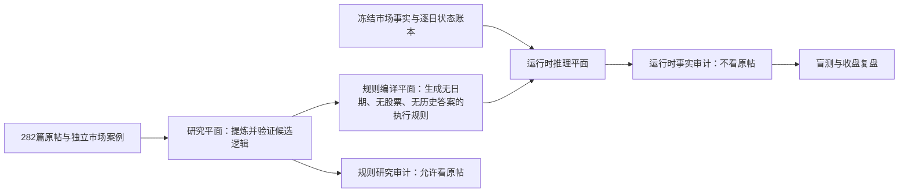

# roubing AI 推理工程重构方案 V2

日期：2026-09-11
状态：方案重审稿；本文件不代表代码已经完成修改。
原则：保留现有 V1、V2、V3、V4、旧运行结果和旧 TODO，不删除、不覆盖；旧结果只作为问题证据。

## 一、结论先说清楚

当前工程不是局部提示词问题，而是知识架构发生了混层。

正确目标应是：

```text
让 AI 学会 roubing 如何从当时可观察事实出发，
判断环境、方向、节点、角色、竞争和次日任务。
```

当前实际做成了：

```text
当日市场事实
+ 与任务关键词相近的原帖片段
+ 作者在历史帖子里对方向、股票和阶段的判断
→ AI 生成当日结论
```

这会导致 AI 看似说得很像 roubing，实际上部分结论是从作者历史答案中抄出来的，而不是依据市场事实独立推出的。

2026-01-05 的错误示例：

```text
“商业航天仍有14家涨停……原帖记载该方向自2025-11-28起持续作为主流观察。”
```

其中“14家涨停、4板/2板/首板梯队”是 1 月 5 日市场事实，可以使用；“自 2025-11-28 起持续作为主流”来自作者旧帖，是历史答案，不能补充缺失的逐日状态账本。

在当前只有 1 月 5 日截面、没有此前逐日推演的情况下，正确输出只能是：

```text
商业航天当日有14家涨停，并形成4板、2板和首板梯队，当前截面具有较强的方向结构。
由于缺少1月5日之前的逐日状态账本，不能确认它是“仍在延续的主流”，
也不能确认这套梯队是增强、修复还是衰减后的残留。
```

因此，接下来不能继续围绕旧 TODO 补小功能。必须先把“研究原帖”“编译规则”“运行推理”“结果审计”彻底分开。

---

## 二、原方案哪里正确，哪里本身就有问题

### 2.1 应保留的正确原则

《ROUBING_LEARNING_MASTER_PLAN》中的以下主线是正确的：

```text
原帖
→ 提炼可迁移逻辑
→ 独立重建历史事实
→ 正例、失败例和边界例验证
→ 隐藏作者答案
→ AI 在未见日期独立推理
```

以下纪律也必须保留：

1. 作者原话、作者当时判断、独立市场事实、研究归纳和工程纪律必须分层。
2. 不能把单个历史案例直接变成通用规则。
3. 不能把个案数字变成永久阈值。
4. 不能使用目标时点之后的信息。
5. 缺少数据时必须拒绝确认依赖该数据的结论。
6. 必须保留同期竞争者、失败候选和反方解释。
7. AI 应先判断环境和节点，再产生候选，不能先找强股再补故事。

### 2.2 主控方案中存在的一处歧义

主控文档 P7 写过：

```text
“每个判断必须引用对应原帖逻辑和当天市场证据。”
```

这句话容易被误实现为“每次运行都把原帖片段交给 AI”。正确解释应改为：

```text
运行时判断必须引用抽象规则 ID 和当天事实 ID；
规则 ID 在离线研究库中能够追溯到原帖，但运行模型看不到原帖正文和作者案例答案。
```

因此，主控方案的大方向正确，但“可追溯到原帖”与“运行时读取原帖”没有被明确隔离，这是后续设计跑偏的入口。

### 2.3 工程 V1 发生的关键偏离

《roubing 逻辑驱动的 AI 选股工程 V1》中以下设计需要纠正：

1. “把最相关的原文片段与结构化规则一起交给 AI”不应出现在正式运行链路。
2. 运行报告的五栏中包含“作者规则或解释”，容易把作者历史判断混入当前结论。
3. 输出证据要求包含“原帖日期和规则”，使模型主动寻找与当前市场相似的作者答案。
4. Stage B、C、D 和审计都读取原帖，使推理和审计共享同一份答案污染。
5. 将 282 篇帖子做成可检索运行时知识库，混淆了“研究材料库”和“执行规则库”。
6. 简单按 `as_of` 截断帖子或规则，只能防止未来帖子污染，无法阻止目标日期之前的作者答案污染。

### 2.4 实际执行顺序也越级了

主控计划真实状态是：P3 尚未完成，P4、P5、P6 尚未开始；但工程已经直接进入 P7、P8、P9。

这意味着当前 `units.json` 中很多内容虽然写成规则，还没有完整经过：

- 独立事实重建；
- 支持案例验证；
- 失败和边界案例验证；
- 竞争解释排除；
- 未见日期盲测。

所以当前工程可以称为“带有 roubing 研究线索的原型”，不能称为“已经学会完整 roubing 逻辑的执行系统”。

---

## 三、必须建立的五个隔离平面



### 3.1 研究平面：允许完整阅读 282 篇原帖

用途：理解 roubing 在解决什么问题，以及她如何从事实走到判断。

允许读取：

- 282 篇原帖全文；
- 原帖中的日期、板块、股票和作者结论；
- 作者事后复盘；
- 独立行情、公告和监管事实；
- 后续真实结果；
- 正例、失败例和边界例。

研究平面每篇文章需要拆成：

1. 可迁移的观察逻辑；
2. 作者当日主观判断；
3. 作者描述的市场事实；
4. 可独立核验的市场事实；
5. 后验结果；
6. 个案数字；
7. 非执行性表达；
8. 尚未解决的定义或冲突。

本平面的产物不是运行规则，而是“候选逻辑”和案例验证材料。

### 3.2 规则编译平面：把研究结论编译成无答案的抽象方法

只有完成跨案例验证的逻辑，才允许进入执行规则库。

每条可执行规则至少包含：

```text
rule_id
规则版本
它要解决的交易问题
适用的前态
必须观察的事实字段
关系判断步骤
必须比较的参照物或竞争组
至少一个竞争性解释
确认条件
取消条件
数据不足时的输出
适用边界
证据等级
```

执行规则正文禁止出现：

- 特定历史日期；
- 股票名称和代码；
- 作者当时认定的主流方向；
- 历史最终赢家；
- 个案涨幅、封单、成交额和观察天数，除非已被独立证明为必要通用阈值；
- “某年某月作者说过某方向持续为主流”等案例答案。

规则来源应单独存入研究元数据库：

```text
rule_id
→ 来源帖子、段落、原文哈希
→ 支持案例
→ 失败案例
→ 边界案例
→ 研究者解释
```

这条来源链用于离线审计，但不进入运行模型的上下文。

### 3.3 数据与状态平面：只保存当时可观察的市场世界

该平面保存：

- 冻结到 `as_of` 的市场事实；
- 指数、板块、个股、涨跌停、竞价、分钟和成交事实；
- 公告、涨停原因和当时有效监管规则；
- 数据来源、抓取时间和完整度；
- 前一日由系统自己生成并通过审计的状态账本；
- 每个方向、节点、角色和竞争组的历史状态变化。

该平面禁止通过原帖补数据。

例如，状态账本缺少 2025-11-28 至 2026-01-04 的连续记录，就必须承认无法确认“仍在延续”，不能从 12 月原帖中补出连续性。

### 3.4 运行时推理平面：只能看事实、状态和抽象规则

Stage B、C、D 的正式输入只允许包含：

1. 当前 `as_of` 事实包；
2. 已审计的前一日状态账本；
3. 无日期、无股票、无历史答案的抽象规则；
4. 确定性程序生成的候选池和竞争组；
5. 数据完整度；
6. 上一阶段已经冻结的计划；
7. 输出 Schema 和工程纪律。

正式运行禁止读取：

- 原帖正文或节选；
- 原帖检索结果；
- 作者当时对板块和股票的判断；
- 作者案例中的历史赢家；
- 规则来源日期、标题和股票案例；
- 目标时点之后的结果；
- 未完成验证的候选逻辑。

运行输出只能引用：

- `fact_id`：本次事实包中的事实；
- `state_id`：此前已审计状态；
- `rule_id`：执行规则；
- `data_gap_id`：阻止某项确认的数据缺口。

不能引用原帖日期或原帖句子。

### 3.5 评估与审计平面：必须拆成三种审计

### A. 运行时事实审计

输入：事实、状态、执行规则、模型输出。
禁止：原帖和作者答案。

检查：

- 结论是否真的由可见事实支持；
- 是否跨越 `as_of`；
- 是否把数据不足写成确认；
- 是否跳过前态、节点、角色或竞争组；
- 是否把相关性写成资金因果；
- 是否把规则中的“必要观察项”漏掉。

### B. 规则研究审计

输入：原帖、独立事实、规则候选、正反案例。
用途：检查规则是否忠于 roubing、是否把个案泛化、是否漏掉语境。

它只能离线运行，不能参与某日选股结论。

### C. 盲测评估

第一步只给目标日当时事实和执行规则，保存 AI 原始判断；第二步才揭示作者答案和后续市场结果。

分别评价：

- 方法忠实度；
- 事实充分性；
- 竞争解释质量；
- 时间边界；
- 不确定性表达；
- 后续市场结果。

不能把“和作者答案不同”直接判为失败，也不能把“后来上涨”直接判为推理正确。

---

## 四、282 篇原帖究竟怎样使用

282 篇原帖应该全部用于研究覆盖，但不应在每次市场推理中重新检索。

正确流程：

```text
282篇原帖
→ 逐篇分类
→ 提出候选逻辑
→ 独立还原案例事实
→ 查找支持例、失败例和边界例
→ 编译为不含历史答案的执行规则
→ 规则盲测
→ 通过后进入运行规则库
```

正式运行时：

```text
当日事实 + 状态账本 + 执行规则
→ 独立推理
```

不再出现：

```text
当日事实 + 搜索“主流/核心/容量”的原帖片段
→ 参考作者历史答案推理
```

“282 篇都用上”应表示研究覆盖率和规则来源覆盖率，而不是一次推理把 282 篇全文或其中若干相似帖子塞给模型。

---

## 五、完整语料形成的方法版本怎样用于历史回放

需要明确区分两种合法模式。

### 5.1 `FIXED_FINAL_METHOD`：推荐作为当前主模式

含义：使用从全部 282 篇中最终提炼并验证通过的抽象方法，分析任意历史或未来日期。

允许：

- 使用后来帖子才讲清楚的可迁移方法；
- 使用最终版本的抽象规则。

禁止：

- 使用后来帖子中的具体股票、板块、日期和赢家答案；
- 使用目标日之后的市场事实；
- 伪装成“当时的作者已经知道这套完整方法”。

这种模式回答的是：

> 如果把完整 roubing 方法交给 AI，它能否只凭当时事实独立推理？

### 5.2 `AS_OF_METHOD_VERSION`：严格策略演进模式

含义：某历史日期只能使用当时已经发表、并在当时规则版本中可用的方法。

这种模式适合研究方法随时间如何变化，但不是当前第一目标。

此前按目标日期直接删除所有未来来源规则，混淆了“未来方法”和“未来答案”。新架构应分别控制：

- 市场事实截止时间；
- 方法版本；
- 案例答案可见性。

---

## 六、重构后的每日推理流程

### Stage A：冻结事实

程序只做数据清洗和确定性计算，不出现“主流、核心、洗盘、主动资金”等解释词。

输出：

- 当前市场宽度；
- 指数和板块路径；
- 方向内涨停、炸板、跌停、梯队和扩散；
- 个股成交、价格路径、竞价、分钟事件；
- 公告、涨停原因和监管事实；
- 数据缺口。

### Stage B：环境与方向状态

AI 读取 Stage A、前一日账本和环境类抽象规则。

依次回答：

1. 今天市场整体处于什么候选状态；
2. 哪些方向有结构；
3. 哪些方向只是当日热点；
4. 哪些方向可能延续，但缺什么连续证据；
5. 哪些竞争解释尚未排除。

没有历史账本时，只能做“当日截面判断”，不能输出“仍然延续”“持续主流”“完成切换”等跨日结论。

### Stage C：节点识别与候选池生成

先识别满足前态的节点，再由确定性程序生成同起算日、同功能候选池。

必须明确：

- 节点前态；
- 锚定日期；
- 候选从哪个真实集合产生；
- 为什么这些股票可比较；
- 哪些股票因不属于同一功能而不能比较；
- 节点尚未确认时需要观察什么。

### Stage D：角色与竞争推理

角色不是静态标签，而是当前方向内承担的功能假设。

依次判断：

1. 候选可能承担什么任务；
2. 该任务需要哪些次日行为才能确认；
3. 谁是同组真实竞争者；
4. 哪些事实只支持“候选”，不能支持“已经是核心”；
5. 什么事件会导致角色迁移或被替代。

### Stage E：生成次日计划

只输出三条路径：

- 主路径；
- 替代路径；
- 不行动路径。

每只候选必须包含：

- 盘前前态；
- 次日必须完成；
- 允许的正常变体；
- 失败信号；
- 需要的市场或板块响应；
- 数据不足时怎样处理。

### Stage F：09:25 和 09:35 验证

只验证前一晚已经写下的任务，不临时改写理由。

验证顺序：

1. 竞价是否符合角色预期；
2. 开盘卖压是否被收回；
3. 个股与同组对手谁先完成任务；
4. 板块、容量和后排是否响应；
5. 主路径、替代路径或不行动路径哪条成立；
6. 数据不完整时降级到“无法确认”。

### Stage G：收盘复盘

分开记录：

- 当时计划；
- 实际发生；
- 判断错误；
- 数据缺口；
- 规则缺口；
- 是否需要把案例送回研究平面。

运行系统不能直接修改规则。新案例只能进入研究队列，经过重新验证后产生新规则版本。

---

## 七、如何证明 AI 学到的是逻辑，而不是答案

至少需要以下七道验收闸门。

### Gate 1：规则去案例化检查

执行规则正文不得包含历史日期、股票、板块答案、原帖标题和来源日期。

### Gate 2：输入污染检查

Stage B/C/D 任务包中出现 `original_posts.md`、原帖 URL、作者历史判断、案例赢家或来源日期时，运行直接失败。

### Gate 3：同事实重述测试

把板块名和股票名匿名化，只保留关系事实，AI 应仍能按照相同逻辑推理。如果换名后无法推理，说明模型记住的是案例，不是方法。

### Gate 4：反例测试

提供形态相似但前态不同的案例，AI 必须拒绝套用规则。例如只有单日 14 家涨停、没有连续状态时，不能自动说“主流延续”。

### Gate 5：缺数据测试

删除前一日状态、板块分时或竞争组数据，AI 必须主动降低结论级别，而不是从原帖或常识补答案。

### Gate 6：未见日期盲测

选择没有进入规则示例、且模型看不到作者答案的日期，先保存结论，再揭示结果。

### Gate 7：证据链重放

任何结论都应能沿以下路径重放：

```text
输出句子
→ fact_id/state_id
→ rule_id 中的判断步骤
→ 确认或拒答原因
```

运行时不需要、也不允许沿着原帖句子重放。

---

## 八、当前工程模块怎样处理

### 8.1 可以保留

以下能力与“答案污染”无直接冲突，可以保留并在新架构中复用：

- 原始行情仓库和确定性事实包；
- `as_of` 时点冻结和未来字段检查；
- opening match、竞价未匹配量、分钟和板块数据接线；
- 数据缺口的结构化 `BLOCKED_DATA`；
- 监管规则按生效日版本化；
- 候选池的确定性覆盖检查；
- 竞争组、角色任务和唯一性所需的 Schema；
- Stage D 的数据充分性硬门；
- provenance、输入哈希、不可覆盖运行结果；
- 外部 skill 污染检测；
- CI、单元测试和日志保存。

保留不代表其中所有交易规则已经正确，只代表这些工程基础可以复用。

### 8.2 必须重构

1. `rules/units.json`
   - 拆成运行规则正文与离线来源元数据；
   - 逐条删除日期、案例股票和历史答案；
   - 未完成 P4-P6 验证的规则降级为研究候选，不进入正式运行。

2. `rules/retrieve.py`
   - 不再按原帖来源日期渲染规则；
   - 改为按任务和规则 ID 选择纯方法规则；
   - 分别支持 `FIXED_FINAL_METHOD` 和 `AS_OF_METHOD_VERSION`。

3. `rules/evidence_bundle.py`
   - 从“规则 + 原帖案例召回”改为“运行所需规则 + 事实字段覆盖”；
   - `required_case_keywords`、`matched_case_hashes` 不再进入运行包。

4. `reasoning/eod_pipeline.py`
   - 删除 Stage B、Stage C 和 audit 的 `original_posts.md`；
   - provenance 只记录事实、状态、规则版本和 Schema。

5. `reasoning/validate_pipeline.py`
   - 删除 Stage D 的原帖检索和原帖输入；
   - 验证器只看冻结计划、T+1 事实和验证规则。

6. `reasoning/prompts.py`
   - 删除所有“阅读 original_posts.md”的要求；
   - 禁止输出原帖日期和作者历史判断；
   - 结论强制引用 `fact_id/state_id/rule_id`。

7. 审计模块
   - 拆成运行时事实审计和离线规则研究审计；
   - 两者不得共享提示词和输入包。

8. 规则与案例库
   - `corpus_units.json`、`corpus_case_cards.json` 保留在研究平面；
   - 不得由日常运行管线读取。

### 8.3 必须降级或作废为“策略证明”的内容

- 当前 2026-01-05 Stage B/C/D 结果；
- 所有运行时读取过原帖的回归结果；
- “282 篇已进入运行知识库”作为完成证明；
- 仅按关键词召回测试通过作为“逻辑已覆盖”的证明；
- 仅凭 52 项工程测试通过作为“策略方向正确”的证明；
- 旧 TODO 中 D1-D4 的完成状态。

这些文件不删除。它们应保留并标记为 `INVALID_FOR_METHOD_EVALUATION`，用于证明旧架构为何不合格。

---

## 九、推荐重构顺序

### 第 0 步：冻结旧结果

不覆盖现有运行目录，不删除旧规则库，记录旧结果使用过哪些原帖输入。

验收：可以完整重现“商业航天自 2025-11-28 持续主流”是怎样进入输出的。

### 第 1 步：建立知识边界测试

先写失败测试：只要 Stage B/C/D 包中出现原帖正文、URL、来源日期、作者案例答案，测试必须失败。

验收：旧代码应先被这些测试明确判失败。

### 第 2 步：拆分规则库

建立：

- `runtime_rules`：无案例答案的抽象规则；
- `rule_research_metadata`：原帖来源和正反案例；
- `research_candidates`：尚未通过验证的候选逻辑。

验收：运行进程只能导入 `runtime_rules`。

### 第 3 步：重新审计规则成熟度

不能默认当前所有 `units.json` 都是成熟规则。逐条标记：

- 已通过跨案例验证；
- 仅作者明确但未独立验证；
- 稳定归纳但缺反例；
- 个案逻辑；
- 冲突；
- 未知。

只有通过既定门槛的规则进入第一版运行库。

### 第 4 步：切断运行时原帖入口

修改 B/C/D、audit、provenance 和提示词，使正式运行完全看不到原帖。

验收：删除或改写原帖数据库不应改变同一事实包下的运行输入和结果结构。

### 第 5 步：拆分两类审计

运行审计不看原帖；规则研究审计不参与选股。

验收：即使原帖作者明确说某方向是主流，运行审计也不能据此替当前事实补结论。

### 第 6 步：先做最小逻辑闭环

不要一开始恢复全部 G1-G12。先选择一条已完成研究验证的最小场景，完成：

```text
事实 → 前态 → 节点 → 候选池 → 竞争任务 → 次日验证 → 复盘
```

验收后再逐条增加规则。

### 第 7 步：重新运行 2026-01-05

在当前缺少前序账本的条件下，只允许输出 1 月 5 日截面结论。

关键验收：

- 不出现“自某日持续主流”；
- 不引用任何原帖；
- 不把商业航天直接判为“延续”，除非独立状态数据支持；
- 能区分“当日结构强”与“跨日主流已确认”；
- 所有结论只引用事实 ID、状态 ID 和规则 ID。

### 第 8 步：盲测后再恢复完整工程路线

至少一轮未见日期盲测通过后，才继续扩展节点、角色、竞价和多日回放。

---

## 十、当前范围内的新 TODO 总纲

旧 TODO 暂时停止继续打勾。新 TODO 应按以下顺序建立：

1. 记录旧方案污染链；
2. 增加运行时禁止原帖的失败测试；
3. 设计运行规则 Schema；
4. 分离规则正文与研究来源；
5. 逐条审计现有规则成熟度；
6. 删除 B/C/D 运行时原帖输入；
7. 删除运行审计的原帖输入；
8. 建立独立规则研究审计；
9. 改造证据引用为 `fact_id/state_id/rule_id`；
10. 增加匿名化、反例、缺数据和未见日期测试；
11. 选择一条验证充分的最小逻辑闭环；
12. 重跑 2026-01-05；
13. 人工检查每一句结论是否可以不用作者答案独立推出；
14. 通过后再决定是否恢复其他旧 TODO。

每一项仍执行“修一个、自检一个、通过后再进入下一个”的纪律。

---

## 十一、这次方案重审后的最终判断

当前工程的问题确实首先出在方案，而不只是实现。

原始学习主线“提炼逻辑、隐藏答案、独立推理”是对的；后续工程 V1 把“规则可追溯到原帖”错误扩大成“运行时应检索原帖”，又在 P3-P6 未完成时提前工程化，最终让作者案例答案进入了市场判断。

正确修复不是把那句“原帖记载……”删掉，也不是增加一条禁止引用原帖的提示词，而是：

```text
研究时充分阅读原帖；
编译时只保留可迁移方法；
运行时彻底隐藏原帖和作者答案；
审计时把规则忠实度与运行事实性分开；
通过盲测证明 AI 真正在使用逻辑。
```

在这套边界建立之前，继续补充角色、唯一性、竞价或盘口代码，只会把错误架构做得更复杂。
